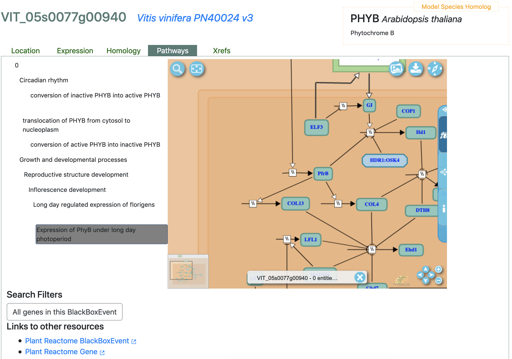

**_Vitis vinifera_ PanGenome**

This user guide refers to the contents of the first public release (August 2021) of the Grape PanGenome. Currently, the PanGenome hosts 18 genomes including 11 _Vitis vinifera_ genomes, and 7 outgroups (_Arabidopsis thaliana_, _Oryza sativa_Japonica_, _Sorghum bicolor_, _Zea mays B73_, _Selaginella moellendorffii_, _Chlamydomonas reinhardtii_, and _Drosophila melanogaster_).

At present, most data types are only available for the _PN40024 _reference version 3, so this guide will focus on the phytochrome B gene model (PHYB), using its v3 gene identifier: VIT_05s0077g00940.

---

Let’s begin!

Go to [http://vitis.gramene.org/](http://vitis.gramene.org/)

Locate the search box at the top left corner of the page. Type a search term (gene, species, pathway, ontology term, protein domain, etc.). For the exercises below, we will focus on searching for the grape PHYB gene or VIT_05s0077g00940.

**PanGenome Search Interface**

**Querying a Gene**

Let’s start by typing “PHY...B” in the search box and observe the auto-completion suggestions that pop-up as you type, as well as the various data categories in which the potential results are organized.

The image below shows the default view of the [results from searching for PHYB](http://vitis.gramene.org/?filters={%22status%22:%22init%22,%22operation%22:%22AND%22,%22negate%22:false,%22marked%22:false,%22leftIdx%22:0,%22rightIdx%22:3,%22children%22:[{%22fq_field%22:%22_terms%22,%22fq_value%22:%22PHYB%22,%22name%22:%22PHYB%22,%22category%22:%22Gene%22,%22leftIdx%22:1,%22rightIdx%22:2,%22negate%22:false,%22showMenu%22:false,%22marked%22:true}],%22showMarked%22:true,%22showMenu%22:false,%22moveCopyMode%22:%22%22,%22searchOffset%22:0,%22rows%22:20}&genomes=) (phytochrome B). Depending on how the gene name, locus name, gene synonyms and gene description were assigned to a gene model, you may get one or multiple hits for a query.

Select “PHYB” from the Gene list of results. Notice that it has a number 4 next to it; this indicates that there are four genes associated with it. You will see the four genes associated with this term, including the grape VIT_05s0077g00940 model. Even though the v4 (Vitvi05g00130) model is identical to VIT_05s0077g00940, the annotation for v4 gene models is still under way, and in this case has not been associated with “PHYB”. Therefore, we encourage you to focus on the v3 model for your gene of interest, and compare side-to-side its structure with the corresponding v4 model by looking at the pair in their corresponding gene family tree (see the Homology section below).

If you click on the Homology tab for VIT_05s0077g00940, you will notice that the v3 (VIT_05s0077g00940) and v4 (Vitvi05g00130) models appear identical. As mentioned above, we will focus on v3 models because data for v4 models is limited. For example, gene expression and pathways data has only been associated with v3 models.

Before we go on, here is a summary of the five data categories in which the results of a gene search are organized. These also correspond to the tabs at the top of the results panel for each gene in the image above.

* **Location** - Genomic context
    * Ensembl Browser (Gramene Maize PanGenome)
    * Phytomine
* **Expression** - Baseline gene expression from [EBI-Expression Atlas](https://www.ebi.ac.uk/gxa)
* **Homology** - Customizable Ensembl Compara gene family trees with displays:
    * Alignment Overview (full-length gene)
    * Multiple-Sequence Alignment (zoom into the amino acid level)
    * Neighborhood Conservation View (zoom out +/- 10 flanking genes)
* **Pathways** - Association to pathways in [Gramene’s Plant Reactome](https://plantreactome.gramene.org)
* **Xrefs** - Cross-references to other databases

To limit the results to grape genomes, may click on the spider gear icon and deselect the non-grape outgroups (e.g., _Arabidopsis_, _Oryza_, _Sorghum_, _Vitis_, _Selaginella_, _Chlamydomonas_, and _Drosophila_), then click on “Submit”. This filtering step should render the v3 model as a single result with the Homology tab open:

Note: More complex queries can be constructed using junctions such as AND/OR (click on your search term in the query box to see your options) to combine genes identified by gene name or gene ID, or genes that share, for example, an InterPro domain or a Gene Ontology function, or simply to retrieve a list of genes associated with a pathway. The query box below can be obtained by typing “inflorescence development” in the search box, and changing the default “AND” to “OR”). Query terms may be deleted, copied, moved or negated (see options in the Filters inset on the left).

Note that the number of hits for your search is reflected in the karyotype view on top, where every chromosome of a genome is represented as a colorful box and every hit of a query is represented as a tick mark overlaid on its corresponding karyotype. Therefore, you will see six tick marks along the karyotype corresponding to the six genes in the “inflorescence development” pathway.

To follow this exercise, you could click on “delete” for the inflorescence pathway and select “All” the available species in the gene tree, then select the Homology view for the VIT_05s0077g00940 gene. However, to simplify the images, I will redo a new search using “VIT_05s0077g00940”.

Clicking on the spider gear that precedes the “Display Mode” drop-down menu, allows you to configure the labels for members of the family tree, the choices are: Species, Gene name, Gene ID, and Protein ID (see image below).

**Homology Views**

Click on the “Display Mode” drop-down menu to select one of three displays for the Homology view: Alignment overview, Multiple Sequence Alignment, and Neighborhood conservation.

1. The** Alignment Overview** allows you to view the entire length of the protein. Proteins are color-coded by InterPro domain. Click anywhere in one of the colored protein domains to reveal its name and some statistics. 

    

You may expand collapsed taxonomic clades, which are symbolized by triangles along the branches of the tree, by clicking on the black (speciation) or red (duplication) nodes and selecting the option “Expand”. Already expanded clades can be contracted by selecting the option “Collapse” that appears upon clicking a node.

For the following exercises, let’s expand all the rosid clades so that we can see every grape gene in the tree as a single row. You will notice that most of the Chardonnay gene models appear split in two. 

Putative split genes are marked with a blinking yellow node (it will only blink for a few seconds after the clade is open), and when you click on it, you will read “gene_split” following the species name (see inset below for the first split gene pair). 

Notice that these gene pairs map to contiguous regions in the chromosome and hence have consecutive gene ids, for example, the second putative split gene pair in the tree consists of VvChar04.ver1.0.g009660 at position GCs104:9825009-9826201:- (N-terminal) and VvChar04.ver1.0.g009650 at position GCs104:9816229-9824982:- (C-terminal). 

You may also prune the tree to only display a subset of the 35 species, by clicking on the spider gear of the Search Filters panel. Hover your mouse over to see a message like: “Genomes Filter” and Searching 35 genomes. Click on it and select the species you want to limit your search to, and also those that you wish to be included in the Homology tree view.

Please note that resizing the gray slider that surrounds the entire protein allows you to navigate along it. Also, at the bottom of the panel notice the number of Homologs, Orthologs, and Paralogs. By clicking on any of them, the corresponding gene list will be displayed. See for example, the list of 4 paralogs of VIT_05s0077g00940 in the figure below.

Let’s go back to the Homology view of the VIT_05s0077g00940 gene search results, and select the Multiple-Sequence Alignment from the Display Mode menu.

2. The **Multiple-Sequence Alignment** allows you to zoom into the amino acid level. Drag the slider along the length of the protein to change the area of detail. This view allows you to observe the degree of amino acid sequence conservation and identify areas where lack of conservation could indicate biologically significant differences such as alternatively spliced forms or mere annotation artifacts. See for example clade-specific amino acid conservation or how amino acid conservation drops and picks back up for the split gene model pairs, and where a missing stretch of amino acids in the GAF domain of the VvChar04.ver1.0.g315290 model might indicate an annotation artifact (or an alternatively spliced transcript, if there is experimental evidence for it).

    Luckily, we have a tool to capture your observations for dubious annotations (please note that at present, this capability is available only for PN40024 v4 gene models). Click on the “Curate” button at the bottom of the inset, and you will be taken to Gramene’s Gene Tree tool. In it, you will see the same tree from the Homology view and on the right, you will be able to qualify gene models as OK or “poor” quality, and submit your annotations via e-mail (see below). The same display options described here are available to zoom in and out the tree view in the tool.

3. Neighborhood Conservation View

    This view presents the target gene in the middle with a red line across the best ortholog in each species in the tree plus 10 flanking genes upstream and downstream color-coded by gene family. This allows you to identify structural variants and Presence/Absence variants in the region in question.

    

    **Location**

    Switch to the “Location” tab to observe the gene structure and alternative transcripts for your target gene. Exons are shown as red boxes, introns as lines, and UTRs as orange boxes. Use the sizing tool to modify the region under observation. The search filters allow users to list all genes in the chromosome or all the genes in the region specified in the field. Links to the [Vitis PanGenome Browser](http://vitis-ensembl.gramene.org/Vitis_vinifera/Gene/Summary?g=VIT_05s0077g00940;r=5:710743-718860;t=VIT_05s0077g00940.t01) and [PhytoMine](https://phytozome.jgi.doe.gov/phytomine/keywordSearchResults.do?searchTerm=VIT_05s0077g00940&searchSubmit=Search) are provided at the bottom of the tab.

    **Expression**

    This view depicts baseline gene expression data for defined organism parts (as shown in the image below: fruit, pericarp, and seed), cultivars or developmental stages (the latter only available in the [Expression Atlas website](https://www.ebi.ac.uk/gxa/genes/VIT_05s0077g00940?bs=%7B%22vitis%20vinifera%22%3A%5B%22ORGANISM_PART%22%2C%22CULTIVAR%22%2C%22DEVELOPMENTAL_STAGE%22%5D%7D&ds=%7B%22kingdom%22%3A%5B%22plants%22%5D%7D#baseline)). Experiments are organized by study on the left side, and by tissue or developmental stage on the top of the graph. 

    Unique data points are colored in blue, with intensity increasing in proportion to the level of expression. What this means is that higher expression data points are shown in darker blue. 

    When you hover the cursor over a data point, the data point is highlighted in yellow, and a more detailed data summary will pop up to reveal study (Da Silva _et al_, 2013 in this case), part of the plant, and a quantitative measure of gene expression (in TPM units).

    You may find additional expression data views in our collaborators’ sites, the [Plant Reactome (Expression tab)](https://plantreactome.gramene.org/PathwayBrowser/#/R-VVN-8934036&SEL=R-VVN-8934070&PATH=R-VVN-9030769,R-VVN-9031669,R-VVN-8934088&FLG=VIT_14s0083g01030&DTAB=EX) (cultivars only), and the [Expression Atlas](https://www.ebi.ac.uk/gxa/genes/VIT_05s0077g00940?bs=%7B%22vitis%20vinifera%22%3A%5B%22ORGANISM_PART%22%2C%22CULTIVAR%22%2C%22DEVELOPMENTAL_STAGE%22%5D%7D&ds=%7B%22kingdom%22%3A%5B%22plants%22%5D%7D#baseline) (organism parts, cultivars and developmental stages).

    

    

**Pathways**

From the literature, we know that PHYB is part of the circadian rhythm and inflorescence development pathways. Accordingly, the Pathways panel shows that this gene product catalyzes a reaction in both pathways: conversion of inactive PHYB into active PHYB (circadian rhythm) and expression of PhyB under long day photoperiod (inflorescence development), see the image below.

When you hover the cursor over the reaction in the hierarchy on the left side, the diagram on the right will show the reaction in the context of the corresponding pathway. 

Under “Search Filters”, you have the option of getting a list of all genes in a reaction or an entire pathway. You may also navigate to the Gene and corresponding Reaction pages in the Plant Reactome site, where you will be able to perform more complex analyses of omics data, including pathway-based comparisons across species.

An example of such analysis is illustrated in a short video in the [Gramene series](https://www.youtube.com/channel/UCMtmq20XMccsNUaACuqQJ-w) where transcriptomics data is overlaid onto orthology-based projected pathways to compare expression between mutant and wild-type tissues at distinct developmental stages.

**Cross-References**

In the Xref tab, you will find references to your gene of interest in other databases, including ENA, UniProt, UniParc, and UniGene. Please note that the image below shows cross-references for the v3 model, GRMZM2G017616. As described above, additional databases such as Phytomine are cross-referenced in the Location tab.

    

**Gene & Transcript pages**

From the Location tab, click on the Ensembl Browser link and you will be taken to the gene summary page (or Gene tab, shown below). Click on a transcript from the Transcripts Table and you will reach the selected transcript page.  Here are the links for the corresponding [PHYB gene page](http://vitis-ensembl.gramene.org/Vitis_vinifera/Gene/Summary?g=VIT_05s0077g00940;r=5:710743-718860;t=VIT_05s0077g00940.t01) and [transcript page](http://vitis-ensembl.gramene.org/Vitis_vinifera/Transcript/Summary?db=core;g=VIT_05s0077g00940;r=5:710743-718860;t=VIT_05s0077g00940.t01) in the Grapevine Pan-Genome browser. Click on the options on the left menu to visualize a gene tree, obtain a list of orthologues or paralogues, gene ontology associations, gene expression anatograms, sequence (cDNA, exons, protein), protein domains, etc. 

The image below corresponds to the [Protein summary view of the VIT_05s0077g00940.t01.1](http://vitis-ensembl.gramene.org/Vitis_vinifera/Transcript/ProteinSummary?db=core;g=VIT_05s0077g00940;r=5:710743-718860;t=VIT_05s0077g00940.t01) (grape PHYB) transcript.

")

**Comparative Genomics**

####
**Gene trees**

Ensembl Compara pipeline - [Example](http://vitis-ensembl.gramene.org/Vitis_vinifera/Gene/Compara_Tree?db=core;g=VIT_05s0077g00940;r=5:710743-718860;t=VIT_05s0077g00940.t01)

**Expression**

####
**mRNA and protein alignments**

For the PN40024 v3 genome there are seven tracks with ESTs and EST clusters data available. You can get a complete list by clicking on the spider gear symbol for “Configure this page” (left side menu) or “Configure this image” (Location panel), see the inset in the image below. In addition to grape ESTs, there are EST clusters for the following species or clades: Dicots, Monocots, Arabidopsis, maize, rice, and grape.  Click on the square that precedes the name of the track to turn it on or off and configure it with the available options (normal, with labels, stacked, etc.).

### 
**Genetic, Structural & Phenotypic Variation**

Coming soon...

**Literature References**

[The grapevine genome sequence suggests ancestral hexaploidization in major angiosperm phyla](https://www.nature.com/articles/nature06148).
Jaillon O, Aury JM, Noel B, Policriti A, Clepet C, Casagrande A, Choisne N, Aubourg S, Vitulo N, Jubin C et al. 2007. Nature. 449:463-467.

[Diploid Genome Assembly of the Wine Grape Carménère](https://www.g3journal.org/content/9/5/1331.full). Minio, A., Massonnet, M., Figueroa-Balderas, R., Castro, A., and Cantu, D. 2019. G3: Genes, Genomes, Genetics. 9: 1331-1337.

[The genetic basis of sex determination in grapes](https://doi.org/10.1038/s41467-020-16700-z). Massonnet M, Cochetel N, Minio A, Vondras AM, Lin J et al. 2020.  Nat Commun. 11: 2902.

[The wild grape genome sequence provides insights into the transition from dioecy to hermaphroditism during grape domestication](https://doi.org/10.1186/s13059-020-02131-y). Badouin H, Velt A, Gindraud F, Flutre T, Dumas V et al. 2020. Genome Biol. 21:223.

[Haplotyping the Vitis collinear core genome with rhAmpSeq improves marker transferability in a diverse genus](https://doi.org/10.1038/s41467-019-14280-1). Zou C, Karn A, Reisch B, Nguyen A, Sun Y et al. 2019. Nat Commun. 11: 413.

[The genomic diversification of clonally propagated grapevines](https://doi.org/10.1186/s12864-019-6211-2). Vondras AM, Minio A, Blanco-Ulate B, Figueroa-Balderas R, Penn MA et al. 2019. BMC Genomics.

[The population genetics of structural variants in grapevine domestication](https://www.nature.com/articles/s41477-019-0507-8). Zhou Y, Minio A, Massonnet M, Solares E, Lv Y et al. 2019. Nature Plants. 5: 965–979.

