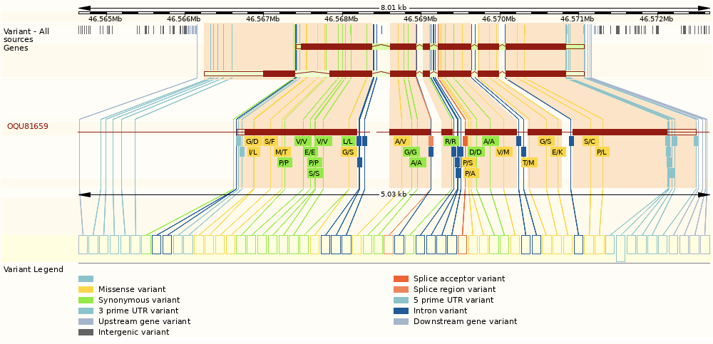

## *Sorghum bicolor* BTx623

*Types of data available for this variant and tips on how to find it.*

## Querying a Sorghum bicolor BTx623 Gene

Search Results Summary

The results of a gene search are organized in five data categories:

- Location - Genomic context
  - Gramene
  - Pangenome site
  - phytozome
- Expression - Baseline gene expression from [EBI-Expression Atlas](https://www.ebi.ac.uk/gxa)
- Homology - Customizable Ensembl Compara gene family trees with displays:
  - Alignment Overview
  - Multiple-Sequence Alignment
  - Neighborhood Conservation View
- Pathways - Association to pathways in [Gramene’s Plant Reactome](https://plantreactome.gramene.org)
- Xrefs - Cross-references to other databases

The example below shows the default view of the results when searching for the [SORBI_3006G095600](https://dev.sorghumbase.org/genes?filters={%22status%22:%22init%22,%22operation%22:%22AND%22,%22negate%22:false,%22marked%22:false,%22leftIdx%22:0,%22rightIdx%22:3,%22children%22:[{%22fq_field%22:%22id%22,%22fq_value%22:%22SORBI_3006G095600%22,%22name%22:%22SORBI_3006G095600%22,%22category%22:%22Gene%22,%22leftIdx%22:1,%22rightIdx%22:2,%22negate%22:false,%22showMenu%22:false,%22marked%22:true}],%22showMarked%22:true,%22showMenu%22:false,%22moveCopyMode%22:%22%22,%22searchOffset%22:0,%22rows%22:20}&genomes=) gene (msd2).

## Gene page
A [gene page](https://ensembl.sorghumbase.org/Sorghum_bicolor/Gene/Summary?g=SORBI_3006G095600;r=6:46566240-46571064),
[transcript page](https://ensembl.sorghumbase.org/Sorghum_bicolor/Transcript/Summary?db=core;g=SORBI_3006G095600;r=6:46566240-46571064;t=OQU81659),
[(SNP) variant page](https://ensembl.sorghumbase.org/Sorghum_bicolor/Variation/Explore?db=core;g=SORBI_3006G095600;r=6:46566240-46571064;t=OQU81659;v=tmp_6_47487513_G_A;vdb=variation;vf=7758800),
and [structural variant page](https://ensembl.sorghumbase.org/Sorghum_bicolor/StructuralVariation/Explore?db=core;g=SORBI_3006G095600;r=6:46566240-46571064;sv=nsv856002;svf=54084;t=OQU81659;v=tmp_6_47487513_G_A;vdb=variation;vf=7758800) (tabs) in the Ensembl browser.

## Comparative Genomics
The following comparative genomics data for BTx623 are available in the SorghumBase genome browser:

- Gene trees (Ensembl Compara pipeline) - [Example](http://ensembl.sorghumbase.org/Sorghum_bicolor/Gene/Compara_Tree?g=SORBI_3006G095600;r=6:46566240-46571064;collapse=2831659,2829950,2830021)

- Genome-wide alignment to *Oryza sativa* Japonica (see [example region](http://ensembl.sorghumbase.org/Sorghum_bicolor/Location/Multi?align=23;db=core;g=SORBI_3006G095600;r=6:46563088-46605099;r1=4:22284737-22339738:1;s1=Oryza_sativa))

- Synteny maps with:
  - Rio
  - RTx430
  - TX2783
  - RTx436
  - *Zea mays* V4 (see [example](http://ensembl.sorghumbase.org/Sorghum_bicolor/Location/Synteny?r=6%3A46563088-46605099&db=core&g=SORBI_3006G095600&otherspecies=Zea_maysb73v4))
  - *Oryza sativa* Japonica

    
## Regulation
### Epigenomics
Genome-wide epigenetic marks related to root system morphology and architecture in sorghum BTx623 deposited under
BioProject [PRJNA454504](https://www.ncbi.nlm.nih.gov/bioproject/PRJNA454504/) (Gladman et al, manuscript in prep.).
Three repetitions available for each of seven samples: leaf lower (vegetative whorl), leaf upper (growing anthesis),
panicle (upper anthesis), root bottom (anthesis), root top (vegetative), stem 1 cm (vegetative) and stem mid internode (anthesis).
- The [example](https://ensembl.sorghumbase.org/Sorghum_bicolor/Location/View?db=core;g=SORBI_3006G095600;r=6:46566240-46571064)
  below shows two samples with very similar patterns of epigenetic variation for the msd2 gene region.

### Baseline Gene Expression (Atlas)

Baseline gene expression data from seven sorghum BTx623 datasets curated and processed by the [EMBL-EBI Expression Atlas](https://www.ebi.ac.uk/gxa/)
[(Emms et al. 2016; Makita et al. 2015; Davidson et al. 2012; Turco et al. 2017; Wang et al. 2018; Olson et al. 2014) and
BioProject [PRJNA293229](https://www.ncbi.nlm.nih.gov//bioproject/PRJNA293229)/[SRP062564](https://trace.ncbi.nlm.nih.gov/Traces/sra?study=SRP062564) by Thurber et al (2015)].
- The [example](https://ensembl.sorghumbase.org/Sorghum_bicolor/Gene/ExpressionAtlas?db=core;g=SORBI_3004G141800;r=4:41625307-41663480;t=OQU84910;v=S4_41077528;vdb=variation;vf=112207) below shows Baseline gene expression for the msd2 gene. 

## Variation
Variation in SorghumBase is available for short variants (genetic variation, which in turn may be naturally occurring or chemically induced), longer than 50 nucleotides (structural variants) and QTL variants associated with physical traits.

### Genetic Variation

Genetic variation data for a sorghum gene is available graphically and in tabular form, and for each variant, a Variant page provides more detailed information. Below are provided examples of each of these data representations.
- An [image](https://ensembl.sorghumbase.org/Sorghum_bicolor/Transcript/Variation_Transcript/Image?db=core;g=SORBI_3006G095600;r=6:46566240-46571064;t=OQU81659;v=tmp_6_47486074_T_C;vdb=variation;vf=3821694) of all the genetic variants mapping to the smaller transcript of the msd2 gene.

- A partial [table](https://ensembl.sorghumbase.org/Sorghum_bicolor/Transcript/Variation_Transcript/Table?db=core;g=SORBI_3006G095600;r=6:46566240-46571064;t=OQU81659;v=tmp_6_47486074_T_C;vdb=variation;vf=3821694) of all the genetic variants mapping to the smaller transcript of the msd2 gene.

- An example of a [Variant summary page](https://ensembl.sorghumbase.org/Sorghum_bicolor/Variation/Explore?db=core;g=SORBI_3006G095600;r=6:46566240-46571064;t=OQU81659;v=tmp_6_47487513_G_A;vdb=variation;vf=7758800)
  for a chemically induced variant (tmp_6_47487513_G_A) with a smaller inset of the [genotype frequency panel](https://ensembl.sorghumbase.org/Sorghum_bicolor/Variation/Population?db=core;g=SORBI_3006G095600;r=6:46566240-46571064;t=OQU81659;v=tmp_6_47487513_G_A;vdb=variation;vf=7758800#14_tablePanel)
  showing the accession (ARS105) bearing the mutation (G|A).

### Naturally occurring genetic variation - Single Nucleotide Polymorphisms (SNPs)
Currently in SorghumBase, there are two SNPs data sets for sorghum BTx623:
- The Morris SNP dataset (Morris et al. 2013) consists of ~265,000 SNPs genotyped in 378 accessions from the US sorghum association panel (SAP).
- The Mace SNP dataset (Mace et al. 2013) includes almost 6.5 million SNPs genotyped in 45 *Sorghum bicolor* lines
  including the BTx623 reference genome plus 2 *S. propinquum* lines reported by Mace and colleagues (Mace et al. 2013).
  The data were obtained by resequencing the genomes of the 44 *S. bicolor* lines representing the primary gene pool and
  spanning dimensions of geographic origin, end-use and taxonomic group (i.e., major races of cultivated *S. bicolor*,
  landraces, improved inbreds, progenitors, wild and weedy), and the first resequenced genome of *S. propinquum*, all of
  which were mapped to the BTx623 *S. bicolor* reference genome.
### Chemically induced variation -  Ethyl methanesulfonate (EMS)-induced mutations
Currently in SorghumBase, there is one collection of EMS-induced mutant lines. EMS is a chemical commonly used to cause point mutations, that is, to change single nucleotides in the DNA of a plant seed.
- The Xin EMS dataset (Jiao et al. 2016) includes almost 1.5 million EMS-induced G/C to A/T transition mutations annotated from 252 M3 families selected from the 6,400 sorghum mutant library in BTx623 background described by Xin and colleagues (Xin et al. 2008). Genomic DNA used for sequencing was pooled from 20 M3 plants per M2 family (Jiao et al. 2016).

## Structural Variation
Data for structural variation for the sorghum BTx623 reference has been imported from the
[Database of Genomic Variants Archive](http://www.ebi.ac.uk/dgva/) (dGVA) from a single study containing around 28
thousand structural variations described by (Zheng et al. 2011). [Here is an example](https://ensembl.sorghumbase.org/Sorghum_bicolor/StructuralVariation/Explore?db=core;r=1:96756-143685;sv=nsv838266;svf=32426;vdb=variation).

## Phenotypic Variation - Quantitative Trait Locus (QTLs)
Data corresponding to 5,843 QTL features for 220 sorghum traits were imported from [Sorghum QTL Atlas]()
and are provided with predicted syntenic locations in maize and rice.
- [Example region](https://ensembl.sorghumbase.org/Sorghum_bicolor/Location/View?db=core;g=SORBI_3006G095600;r=7:61190510-61277060;sv=nsv856002;svf=54084;t=OQU81659;vdb=variation)
  with QTLs associated with multiple traits including greenbug resistance, fresh biomass, and flag leaf height. Hint:
  For additional regions with QTL data in the current sorghum assembly (v.3), use the 
  [physical or genetic (cM) coordinates](http://aussorgm.org.au/dev/wp-content/uploads/2018/08/Consensus-Map_cM-and-bp-coordinates.xlsx) kindly provided by the Sorghum QTL Atlas team.

## References
Aken, Bronwen L., Sarah Ayling, Daniel Barrell, Laura Clarke, Valery Curwen, Susan Fairley, Julio Fernandez Banet, et al. 2016.
"The Ensembl Gene Annotation System."
*Database: The Journal of Biological Databases and Curation*.
PMID: 27337980. https://doi.org/10.1093/database/baw093.

Brenton, Zachary W., Elizabeth A. Cooper, Mathew T. Myers, Richard E. Boyles, Nadia Shakoor, Kelsey J. Zielinski, Bradley L. Rauh, William C. Bridges, Geoffrey P. Morris, and Stephen Kresovich. 2016.
"A Genomic Resource for the Development, Improvement, and Exploitation of Sorghum for Bioenergy."
*Genetics* 204 (1): 21–33.
PMID: 27356613. https://doi.org/10.1534/genetics.115.183947.

Casa, Alexandra M., Gael Pressoir, Patrick J. Brown, Sharon E. Mitchell, William L. Rooney, Mitchell R. Tuinstra, Cleve D. Franks, and Stephen Kresovich. 2008.
"Community Resources and Strategies for Association Mapping in Sorghum."
*Crop Science* 48 (1): 30–40.
https://doi.org/10.2135/cropsci2007.02.0080.

Davidson, Rebecca M., Malali Gowda, Gaurav Moghe, Haining Lin, Brieanne Vaillancourt, Shin-Han Shiu, Ning Jiang, and C. Robin Buell. 2012.
"Comparative Transcriptomics of Three Poaceae Species Reveals Patterns of Gene Expression Evolution."
*The Plant Journal: For Cell and Molecular Biology* 71 (3): 492–502.
PMID: 22443345. https://doi.org/10.1111/j.1365-313X.2012.05005.x.

Emms, David M., Sarah Covshoff, Julian M. Hibberd, and Steven Kelly. 2016.
"Independent and Parallel Evolution of New Genes by Gene Duplication in Two Origins of C4 Photosynthesis Provides New Insight into the Mechanism of Phloem Loading in C4 Species."
*Molecular Biology and Evolution* 33 (7): 1796–1806.
PMID: 27016024. https://doi.org/10.1093/molbev/msw057.

Gladman, N. et al. "Sorghum root epigenetic landscape during limiting phosphorus conditions." *Manuscript in preparation*.

Goodstein, David M., Shengqiang Shu, Russell Howson, Rochak Neupane, Richard D. Hayes, Joni Fazo, Therese Mitros, et al. 2012.
"Phytozome: A Comparative Platform for Green Plant Genomics."
*Nucleic Acids Research* 40 (Database issue): D1178–86.
PMID: 22110026. https://doi.org/10.1093/nar/gkr944.

Jiao, Yinping, John J. Burke, Ratan Chopra, Gloria Burow, Junping Chen, Bo Wang, Chad Hayes, Yves Emendack, Doreen Ware, and Zhanguo Xin. 2016.
"A Sorghum Mutant Resource as an Efficient Platform for Gene Discovery in Grasses."
*The Plant Cell*.
PMID: 27354556. https://doi.org/10.1105/tpc.16.00373.

McCormick, Ryan F., Sandra K. Truong, Avinash Sreedasyam, Jerry Jenkins, Shengqiang Shu, David Sims, Megan Kennedy, et al. 2018.
"The Sorghum Bicolor Reference Genome: Improved Assembly, Gene Annotations, a Transcriptome Atlas, and Signatures of Genome Organization."
*The Plant Journal: For Cell and Molecular Biology* 93 (2): 338–54.
PMID: 29161754. https://doi.org/10.1111/tpj.13781.

Mace, Emma S., Shuaishuai Tai, Edward K. Gilding, Yanhong Li, Peter J. Prentis, Lianle Bian, Bradley C. Campbell, et al. 2013.
"Whole-Genome Sequencing Reveals Untapped Genetic Potential in Africa’s Indigenous Cereal Crop Sorghum."
*Nature Communications* 4: 2320.
PMID: 23982223. http://doi.org/10.1038/ncomms3320.

Makita, Yuko, Setsuko Shimada, Mika Kawashima, Tomoko Kondou-Kuriyama, Tetsuro Toyoda, and Minami Matsui. 2015.
"MOROKOSHI: Transcriptome Database in Sorghum Bicolor."
*Plant & Cell Physiology* 56 (1): e6.
PMID: 25505007. https://doi.org/10.1093/pcp/pcu187.

Morris, Geoffrey P., Punna Ramu, Santosh P. Deshpande, C. Thomas Hash, Trushar Shah, Hari D. Upadhyaya, Oscar Riera-Lizarazu, et al. 2013.
"Population Genomic and Genome-Wide Association Studies of Agroclimatic Traits in Sorghum."
*Proceedings of the National Academy of Sciences of the United States of America* 110 (2): 453–58.
PMID: 23267105. https://doi.org/10.1073/pnas.1215985110.

Olson, Andrew, Robert R. Klein, Diana V. Dugas, Zhenyuan Lu, Michael Regulski, Patricia E. Klein, and Doreen Ware. 2014.
"Expanding and Vetting Sorghum Bicolor Gene Annotations through Transcriptome and Methylome Sequencing."
*The Plant Genome* 7 (2): plantgenome2013.08.0025. https://doi.org/10.3835/plantgenome2013.08.0025.

Paterson, A. H., J. E. Bowers, R. Bruggmann, I. Dubchak, J. Grimwood, H. Gundlach, G. Haberer, et al. 2009.
"The Sorghum Bicolor Genome and the Diversification of Grasses."
*Nature* 457 (7229): 551–56.
PMID: 19189423. https://doi.org/10.1038/nature07723.

Turco, Gina M., Kaisa Kajala, Govindarajan Kunde-Ramamoorthy, Chew-Yee Ngan, Andrew Olson, Shweta Deshphande, Denis Tolkunov, et al. 2017.
"DNA Methylation and Gene Expression Regulation Associated with Vascularization in Sorghum Bicolor."
*The New Phytologist* 214 (3): 1213–29.
PMID: 28186631. https://doi.org/10.1111/nph.14448.

Xin, Zhanguo, Ming Li Wang, Noelle A. Barkley, Gloria Burow, Cleve Franks, Gary Pederson, and John Burke. 2008.
"Applying Genotyping (TILLING) and Phenotyping Analyses to Elucidate Gene Function in a Chemically Induced Sorghum Mutant Population."
*BMC Plant Biology*.
PMID: 18854043. https://doi.org/10.1186/1471-2229-8-103.

Wang, Bo, Michael Regulski, Elizabeth Tseng, Andrew Olson, Sara Goodwin, W. Richard McCombie, and Doreen Ware. 2018.
"A Comparative Transcriptional Landscape of Maize and Sorghum Obtained by Single-Molecule Sequencing."
*Genome Research* 28 (6): 921–32.
PMID: 29712755 https://doi.org/10.1101/gr.227462.117.

Zheng, Lei-Ying, Xiao-Sen Guo, Bing He, Lian-Jun Sun, Yao Peng, Shan-Shan Dong, Teng-Fei Liu, et al. 2011.
"Genome-Wide Patterns of Genetic Variation in Sweet and Grain Sorghum (Sorghum Bicolor)."
*Genome Biology* 12 (11): R114.
PMID: 22104744. http://dx.doi.org/10.1186/gb-2011-12-11-r114.

