**_Zea mays_ PanGenome User Guide**

This user guide refers to the contents of the First Public Release (August 2021) of the Maize PanGenome. Currently, the PanGenome hosts 35 genomes including 25 NAM maize founder genomes (Hufford _et al_, 2021; Gage _et al_, 2020; Yu _et al_, 2008; McMullen _et al_, 2009), 3 versions of the B73 _Zea mays_ reference* (Hufford _et al_, 2021; Jiao _et al_, 2017; Schnable _et al_, 2009), and 7 outgroups (_Arabidopsis thaliana_, _Oryza sativa_ Japonica, _Sorghum bicolor_, _Vitis vinifera_ ssp. _vinifera_ PN40024, _Selaginella moellendorffii_, _Chlamydomonas reinhardtii_, and _Drosophila melanogaster_).

At present, most data types are only available for B73 version 4, so this guide will focus on the loxygenase 9 gene model, also known as lox9 or Zm00001eb005920.

---

Let’s begin!

Go to [http://maize-pangenome.gramene.org/](http://maize-pangenome.gramene.org/)

Locate the search box at the top left corner of the page. Type a search term (gene, species, pathway, ontology term, protein domain, etc.). For the exercises below, we will focus on searching for the maize loxygenase 9 (lox9) gene.

**PanGenome Search Interface**

**Querying a Gene**

Let’s start by typing “lox” in the search box and observe the auto-completion suggestions that pop-up, as well as the various data categories in which the potential results are organized.

The image below shows the default view of the [results from searching for lox9](http://maize-pangenome.gramene.org/?filters={%22status%22:%22init%22,%22operation%22:%22AND%22,%22negate%22:false,%22marked%22:false,%22leftIdx%22:0,%22rightIdx%22:3,%22children%22:[{%22fq_field%22:%22_terms%22,%22fq_value%22:%22lox9%22,%22name%22:%22lox9%22,%22category%22:%22Gene%22,%22leftIdx%22:1,%22rightIdx%22:2,%22negate%22:false,%22showMenu%22:false,%22marked%22:true}],%22showMarked%22:true,%22showMenu%22:false,%22moveCopyMode%22:%22%22,%22searchOffset%22:0,%22rows%22:20}&genomes=) (lipoxygenase 9). Depending on how the gene name, locus name, gene synonyms and gene description were assigned to a gene model, you may get one or multiple hits for this query.

But first, here is a summary of the five data categories in which the results of a gene search are organized. These also correspond to the tabs at the top of the results panel in the image below.

* **Location** - Genomic context
    * Ensembl Browser (Gramene Maize PanGenome)
    * Phytomine
* **Expression** - Baseline gene expression from [EBI-Expression Atlas](https://www.ebi.ac.uk/gxa)
* **Homology** - Customizable Ensembl Compara gene family trees with displays:
    * Alignment Overview (full-length gene)
    * Multiple-Sequence Alignment (zoom into the amino acid level)
    * Neighborhood Conservation View (zoom out +/- 10 flanking genes)
* **Pathways** - Association to pathways in [Gramene’s Plant Reactome](https://plantreactome.gramene.org)
* **Xrefs** - Cross-references to other databases

To reproduce the screen capture shown below, select the “lox9” gene from the suggested results. Please note that searching for lox9 also yields results for LOX9 (capitalized letters), which are not necessarily identical. LOX9 has a number 2 next to it, which indicates two genes associated with it; meanwhile lox9 has a number 1 next to it, which indicates that there is a single gene associated with it. 

To limit the results to maize genomes, click on the spider gear icon and deselect the non-maize outgroups (e.g., _Arabidopsis_, _Oryza_, _Sorghum_, _Vitis_, _Selaginella_, _Chlamydomonas_, and _Drosophila_). This filtering step should render one or more of the following results:

GRMZM2G017616 (B73 _Zea mays _v3)

Zm00001d027893 (B73 _Zea mays_ v4) 

Zm00001eb005920 (B73 _Zea mays_ v5)

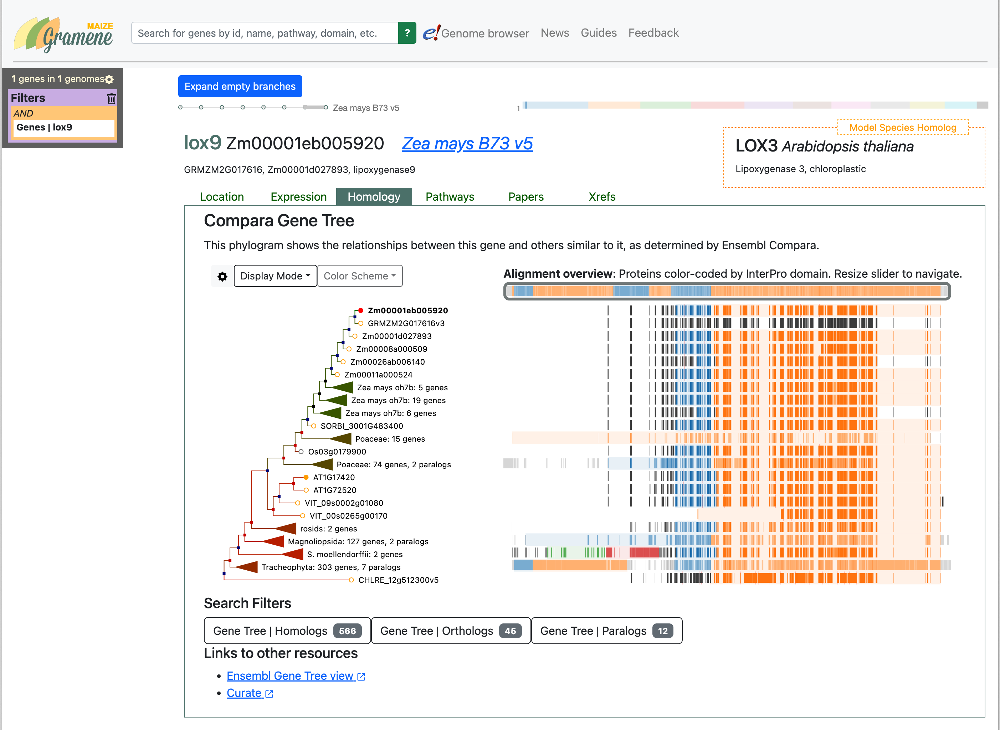

Note: More complex queries can be constructed using junctions such as AND/OR (click on your search term in the query box to see this option) to combine genes identified by gene name or gene ID, or genes that share, for example, an InterPro domain or a Gene Ontology function, or simply to retrieve a list of genes associated with a pathway. The query box below can be obtained by typing the term “jasmonic acid biosynthesis” in the search box, and changing the default “AND” to “OR”). Query terms may be deleted, copied, moved or negated; see all options in the inset below.

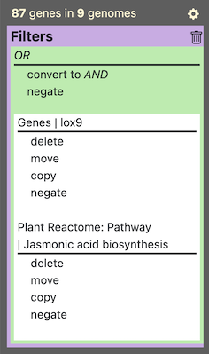

The default screen capture for queries that result in a single gene shows the Homology view of the lox9 gene’s family tree (small letters corresponding to Zm00001eb005920). Note that this is reflected in the karyotype view on top, where every chromosome of a genome is represented as a colorful box and every hit of a query is represented as a tick mark overlaid on its corresponding karyotype. Because it is unique, it defaults to the Homology view (of the five results categories). Maize v5 genes are likely to display their v4 (Zm00001d027893) and v3 (GRMZM2G017616) counterparts as synonyms, and often the same will appear as the gene’s closest homologs in the gene family tree. For the following exercises, I suggest that you focus on the v4 gene model as these currently have the most types of data (e.g., gene expression, pathways) associated with them.

To follow this exercise, click on “delete” for the JA pathway so there is only one result left, the lox9 gene.

To focus on the v4 gene in the family tree that shows up for Zm00001eb005920 (v5 gene), click on the v4 gene name/id to copy the name of the gene from the pop-up panel, and redo your search with the v4 gene id. _Note: You could also select the “Focus on this gene” option and bring the v4 gene to the top of the tree but if you do this, the focus of the rest of the results will still be the v5 gene.

Clicking on the spider gear that precedes the “Display Mode” drop-down menu, allows you to configure the labels for members of the family tree, the choices are: Species, Gene name, Gene ID, and Protein ID (see image below).

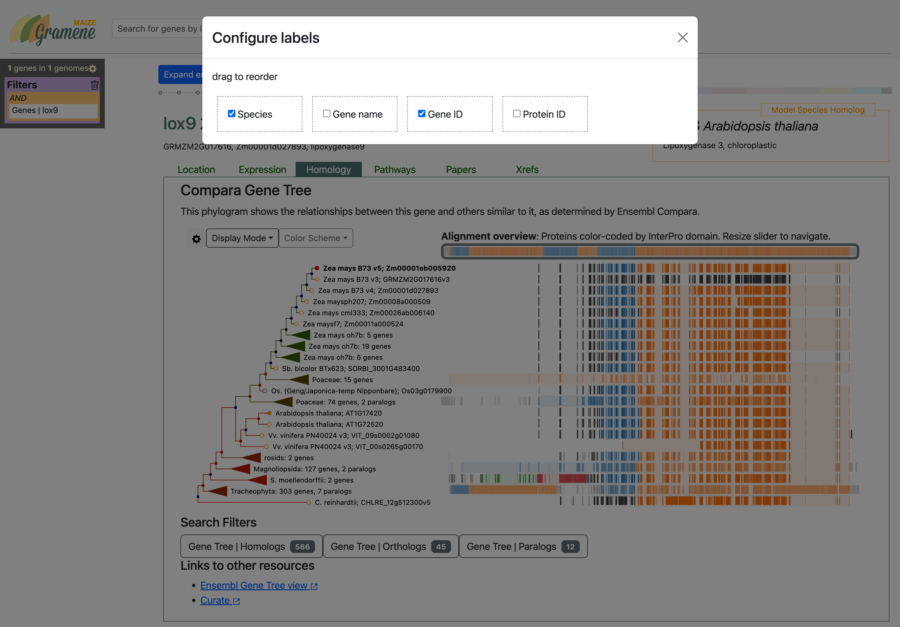

**Homology Views**

Click on the “Display Mode” drop-down menu to select one of three displays for the Homology view: Alignment overview, Multiple Sequence Alignment, and Neighborhood conservation.

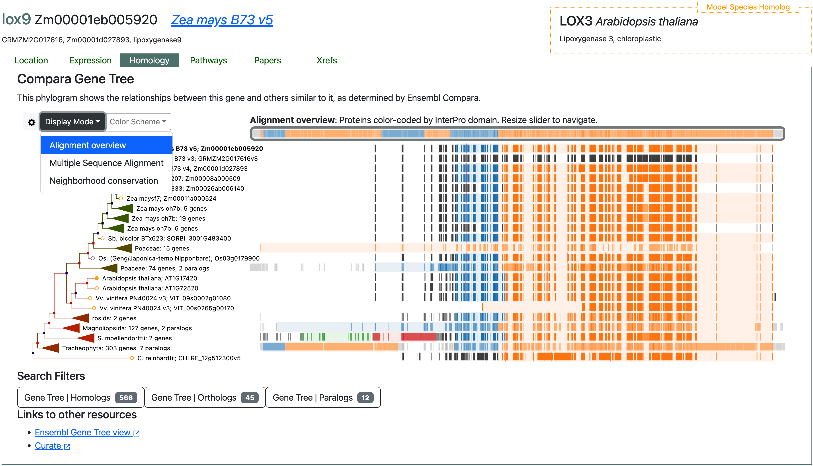

1. The **Alignment Overview** allows you to view the entire length of the protein. Proteins are color-coded by InterPro domain. Click anywhere in the colored protein domain to reveal its name and some statistics.

You may expand collapsed taxonomic clades, which are symbolized by triangles along the branches of the tree, by clicking on the black (speciation) or red (duplication) nodes and selecting the option “Expand”. Already expanded clades can be contracted by selecting the option “Collapse” that appears upon clicking a node.

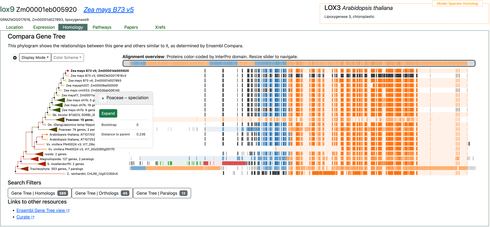

You may also prune the tree to only display a subset of the 35 species, by clicking on the spider gear of the Search Filters panel. Hover your mouse over to see a message like: “Genomes Filter” and Searching 35 genomes. Click on it and select the species you want to limit your search to, and also those that you wish to be included in the Homology tree view.

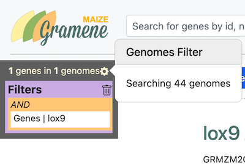

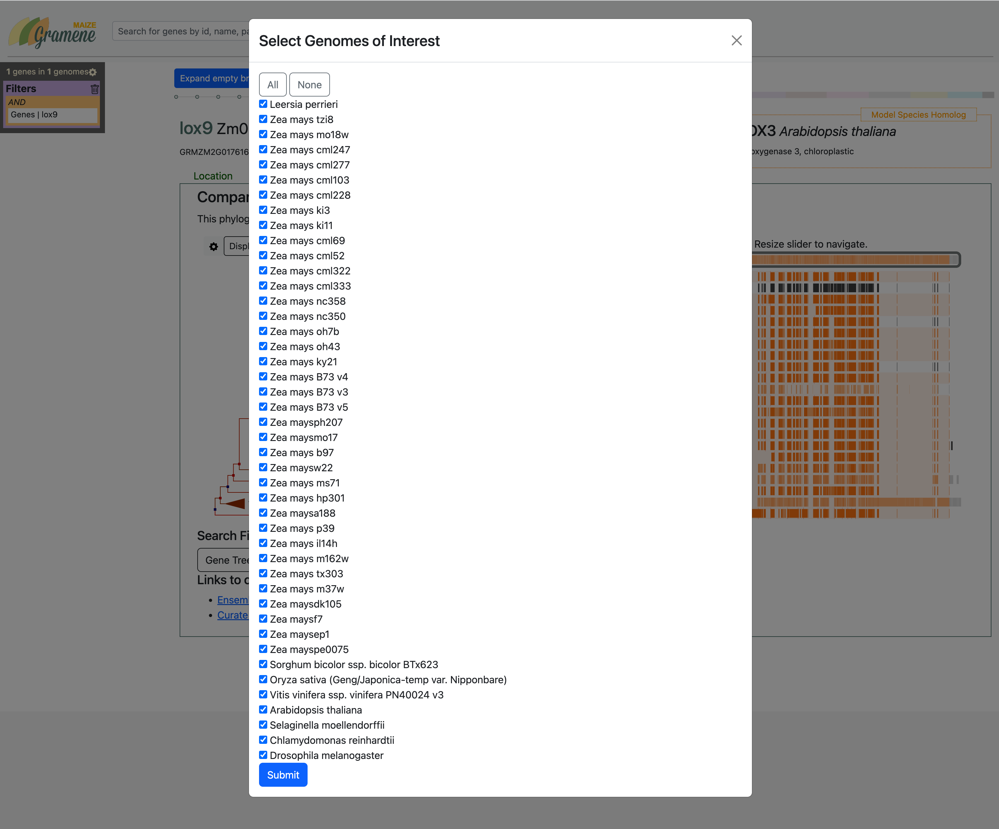

Please note that resizing the gray slider that surrounds the entire protein allows you to navigate along it. Also, at the bottom of the panel notice the number of Homologs, Orthologs, and Paralogs. By clicking on any of them, the corresponding gene list will be displayed. See for example, the list of 13 paralogs in the figure below.

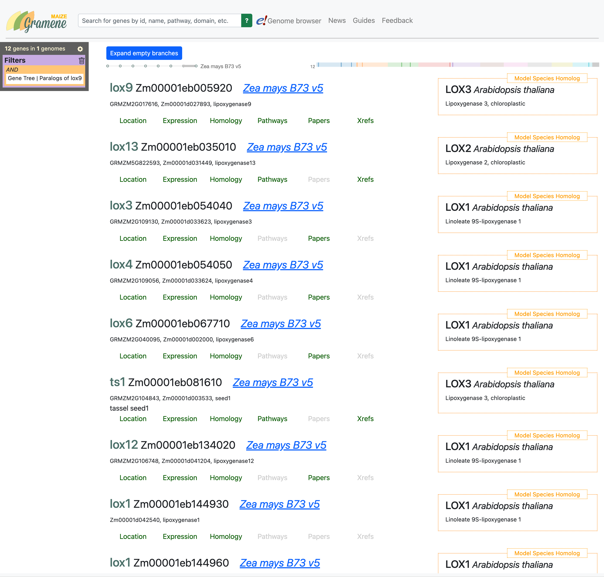

Let’s go back to the Zm00001d027893 gene search results (Homology default view). 

2. The **Multiple-Sequence Alignment** allows you to zoom into the amino acid level. Drag the slider along the length of the protein to change the area of detail. This view allows you to observe the degree of amino acid sequence conservation and identify areas where lack of conservation could indicate biologically significant differences such as alternatively spliced forms or mere annotation artifacts. See for example how the v4 gene differs in the middle of the C-terminal lipoxygenase domain (orange box).

3. **Neighborhood Conservation**

    This view presents the target gene in the middle with a red line across the best ortholog in each species in the tree plus 10 flanking genes upstream and downstream color-coded by gene family. This allows you to identify structural variants and Presence/Absence variants in the region in question.

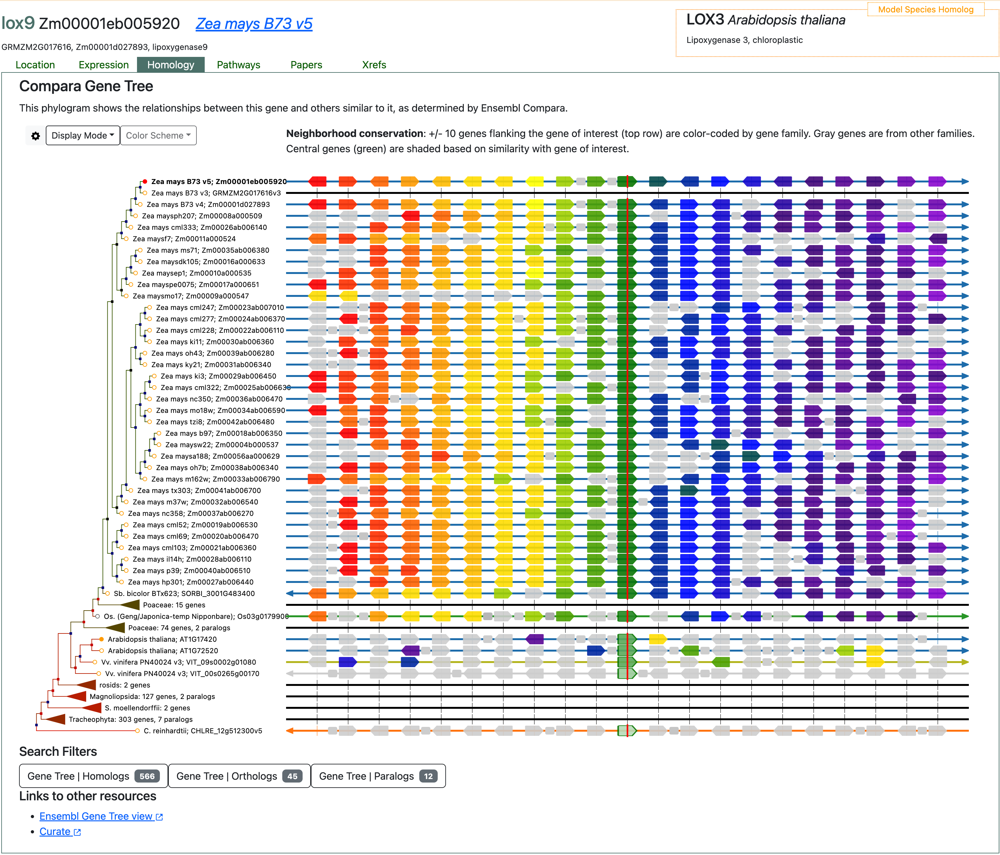

**Location**

Switch to the “Location” tab to observe the gene structure and alternative transcripts for your target gene. Exons are shown as red boxes, introns as lines, and UTRs as orange boxes. Use the sizing tool to modify the region under observation. The search filters allow users to list all genes in the chromosome or all the genes in the region specified in the field. Links to the [Maize PanGenome Browser](http://maize-pangenome-ensembl.gramene.org/zea_maysb73v4/Gene/Summary?g=Zm00001d027893) and [PhytoMine](https://phytozome.jgi.doe.gov/phytomine/keywordSearchResults.do?searchTerm=Zm00001d027893&searchSubmit=Search) are provided at the bottom of the tab.

**Expression**

This view depicts baseline gene expression data for a whole plant (top anatogram on the left of the results box) and for the plant’s reproductive organs (bottom anatogram). Experiments are organized by study on the left side, and by tissue or developmental stage on the top of the graph. 

Unique data points are colored in blue, with intensity increasing in proportion to the level of expression. What this means is that higher expression data points are shown in darker blue. 

When you hover the cursor over a data point, the data point is highlighted in yellow, and a more detailed data summary pops up. The corresponding tissue is also colored in pink in the anatograms.

If instead, you hover over a tissue on the anatogram on the left, the name of the tissue will pop up, and the points corresponding to expression data from that tissue will light up. 

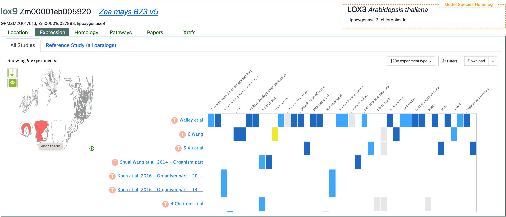

**Pathways**

From the literature, we know that lox9 is part of the jasmonic acid (JA) biosynthesis pathway. Accordingly, the Pathways panel shows that this gene product catalyzes a reaction in two pathways, JA biosynthesis, and 13-LOX/13-HPL.

When you hover the cursor over the reaction in the hierarchy on the left side, the diagram on the right will show the reaction in the context of the corresponding pathway. 

Under “Search Filters”, you have the option of getting a list of all genes in a reaction or an entire pathway. You may also navigate to the Gene and corresponding Reaction pages in the Plant Reactome site, where you will be able to perform more complex analyses of omics data, including pathway-based comparisons across species.

An example of such an analysis is illustrated in a short video in the Gramene series where transcriptomics data is overlaid onto orthology-based projected pathways to compare expression between mutant and wild-type tissues at distinct developmental stages.

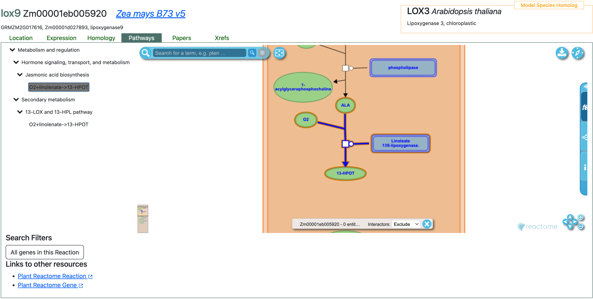

**Cross-References**

In the Xref tab, you will find references to your gene of interest in other databases, including UniProt, UniParc, and UniGene. Please note that the image below shows cross-references for the v3 model, GRMZM2G017616. As described above, additional databases such as Phytomine and MaizeGDB are cross-referenced in the Location tab.

**Gene & Transcript pages**

From the Location tab, click on the Ensembl Browser link and you will be taken to the gene summary page (shown below). Click on any of the transcripts from the Transcripts Table and you will reach the selected transcript page.  Here are the links for the corresponding lox9 [gene page](http://maize-pangenome-ensembl.gramene.org/Zea_maysb73v4/Gene/Summary?db=core;g=Zm00001d027893;r=1:16948608-16955122;t=Zm00001d027893_T001) and [transcript page](http://maize-pangenome-ensembl.gramene.org/Zea_maysb73v4/Transcript/Summary?db=core;g=Zm00001d027893;r=1:16948608-16955122;t=Zm00001d027893_T001) (tabs) in the Maize Pan-Genome browser. Click on the options on the left menu to visualize a gene tree, obtain a list of orthologues or paralogues, gene ontology associations, gene expression anatograms, sequence (cDNA, exons, protein), protein domains, etc. 

The image below corresponds to the [Exons sequence view of the lox9 T001.1 transcript](http://maize-pangenome-ensembl.gramene.org/Zea_maysb73v4/Transcript/Exons?db=core;g=Zm00001d027893;r=1:16948608-16955122;t=Zm00001d027893_T001).

**Comparative Genomics**

#### **Gene trees** (Ensembl Compara pipeline) - [Example](http://maize-pangenome-ensembl.gramene.org/Zea_maysb73v4/Gene/Compara_Tree?db=core;g=Zm00001d027893;r=1:16948608-16955122;t=Zm00001d027893_T001)

**Regulation**

#### **Epigenomics & RNA-Seq Gene Expression (MaizeCODE)**

For the B73 genome there are 188 data tracks available under Regulation. You can get a complete list of all 188 Regulation tracks by clicking on the spider gear symbol for “Configure this page” (left side menu) or “Configure this image” (Location panel), see the inset in the image below. Click on the square that precedes the name of the track to turn it on or off and configure it with the available options being: Wiggle plot, Compact, and Manhattan plot.

These correspond to the following [MaizeCODE data sets](http://www.maizecode.org/data/b73.html):

1. Four genome-wide epigenetic marks (MARK: H3K27ac, H3K4me, H3K4me3, and Input) for five B73 tissues (TISSUE: ears, endo, pollen, root, and cn?) in duplicate (2 repetitions or REP: rep1 and rep2). Corresponding tracks are named as follows: TISSUE_REP (B73 MARK). For example, look for root_rep1 (B73 H3K27ac) in the [image below](http://maize-pangenome-ensembl.gramene.org/Zea_maysb73v4/Location/View?db=core;g=Zm00001d027893;r=1:16924966-17020967;t=Zm00001d027893_T001).

2. RNA annotation and mapping of promoters for analysis of gene expression (RAMPAGE; Batt & Gingeras, 2013) and RNAseq expression data (ASSAYS) is available for four SPECIES (B73, NC350, Ti11, and W22). The corresponding tracks have names in the form of TISSUE_REP STRAND (SPECIES ASSAY), where STRAND is forward or reverse. Find, for example, root_rep1 forward (NC350 RNAseq) in the [image below](http://maize-pangenome-ensembl.gramene.org/Zea_maysb73v4/Location/View?r=1:16947867-16955868;site=ensemblthis;time=1627334587390.39;db=core). 

#### 
**Baseline Gene Expression (Atlas)**

Baseline gene expression data from 25 B73 datasets curated and processed by the [EMBL-EBI Expression Atlas](https://www.ebi.ac.uk/gxa/) are also available from the Maize PanGenome Search, the Ensembl PanGenome gene pages, and the corresponding Plant Reactome panels. The Expression panel of the Search results was described above in detail. The same Expression view for the lox9 gene is available from the [PanGenome browser gene page](http://maize-pangenome-ensembl.gramene.org/Zea_maysb73v4/Gene/ExpressionAtlas?db=core;g=Zm00001d027893;r=1:16947867-16955868;t=Zm00001d027893_T004) and the [Plant Reactome Expression panel](https://plantreactome.gramene.org/PathwayBrowser/#/R-ZMA-1119332&DTAB=EX) (find a link to the Plant Reactome at the bottom of the Pathways panel of the Search results).

lox9 gene expression in the [PanGenome browser gene page](http://maize-pangenome-ensembl.gramene.org/Zea_maysb73v4/Gene/ExpressionAtlas?db=core;g=Zm00001d027893;r=1:16947867-16955868;t=Zm00001d027893_T004)

lox9 gene expression in the [Plant Reactome Expression panel](https://plantreactome.gramene.org/PathwayBrowser/#/R-ZMA-1119332&DTAB=EX)

####
**Genetic, Structural & Phenotypic Variation**

Coming soon...

**Literature References**

Gage, Joseph L., Brandon Monier, Anju Giri, and Edward S. Buckler. 2020. “Ten Years of the Maize Nested Association Mapping Population: Impact, Limitations, and Future Directions.” _The Plant Cell_ 32 (7): 2083–93.

Hufford, Matthew B., Arun S. Seetharam, Margaret R. Woodhouse, Kapeel M. Chougule, Shujun Ou, Jianing Liu, William A. Ricci, et al. 2021. “De Novo Assembly, Annotation, and Comparative Analysis of 26 Diverse Maize Genomes.” _bioRxiv_. https://doi.org/[10.1101/2021.01.14.426684.](http://dx.doi.org/10.1101/2021.01.14.426684)

Jiao, Yinping, Paul Peluso, Jinghua Shi, Tiffany Liang, Michelle C. Stitzer, Bo Wang, Michael S. Campbell, et al. 2017. “Improved Maize Reference Genome with Single-Molecule Technologies.” _Nature_ 546 (7659): 524–27.

McMullen, Michael D., Stephen Kresovich, Hector Sanchez Villeda, Peter Bradbury, Huihui Li, Qi Sun, Sherry Flint-Garcia, et al. 2009. “Genetic Properties of the Maize Nested Association Mapping Population.” _Science_ 325 (5941): 737–40.

Schnable, Patrick S., Doreen Ware, Robert S. Fulton, Joshua C. Stein, Fusheng Wei, Shiran Pasternak, Chengzhi Liang, et al. 2009. “The B73 Maize Genome: Complexity, Diversity, and Dynamics.” _Science_ 326 (5956): 1112–15.

Yu, Jianming, James B. Holland, Michael D. McMullen, and Edward S. Buckler. 2008. “Genetic Design and Statistical Power of Nested Association Mapping in Maize.” _Genetics_ 178 (1): 539–51.
