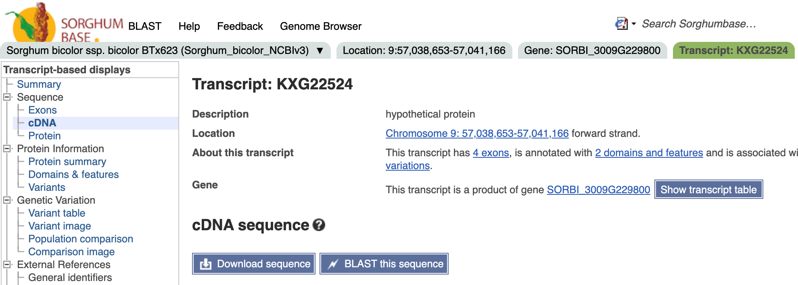
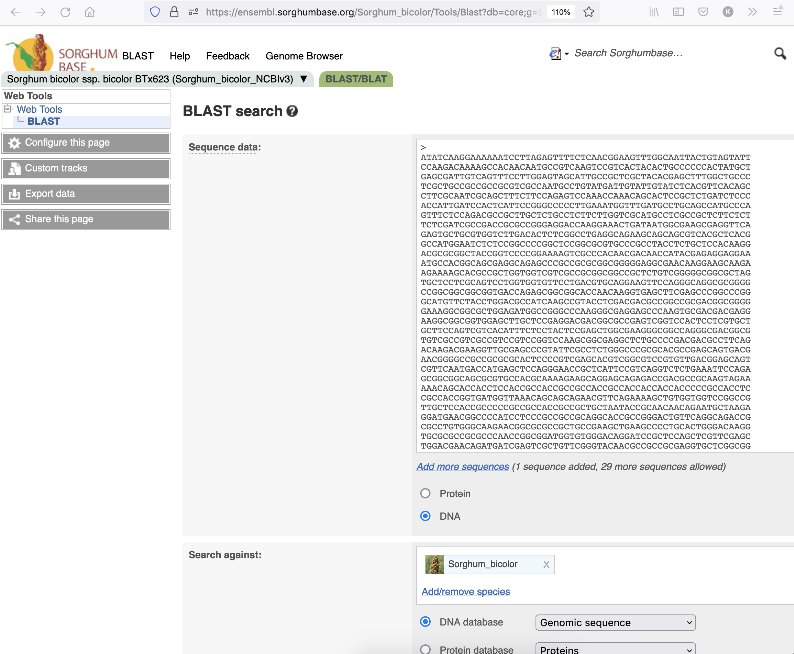
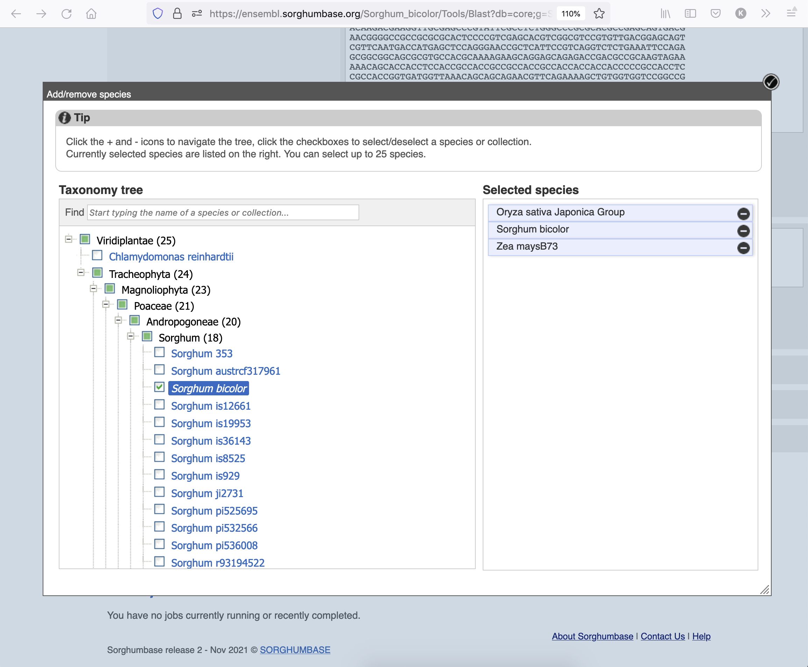
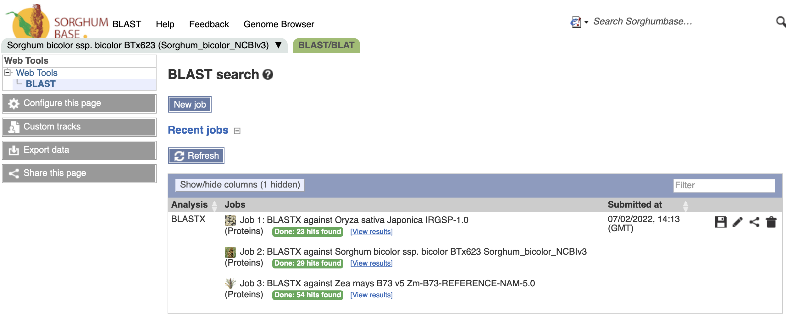
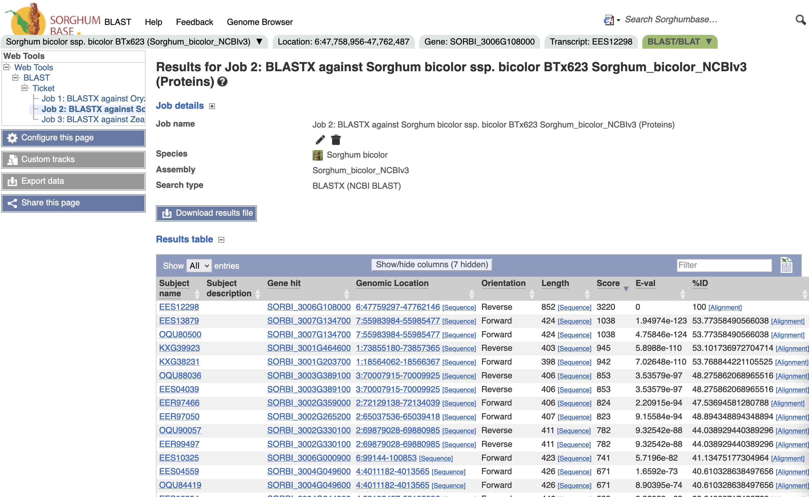
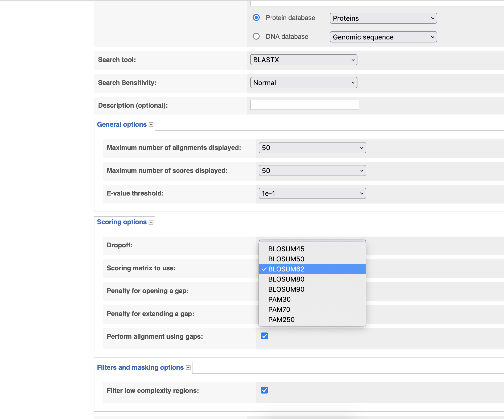
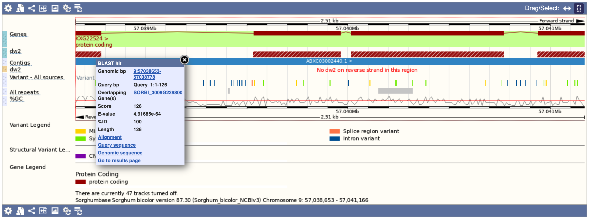

## Guide to use BLAST in SorghumBase

*This guide demonstrates how to BLAST nucleotide and protein sequences in SorghumBase.*

- [What is BLAST?](#define-blast)
- [Where is BLAST?](#go-to-blast)
- [BLAST a nucleotide sequence](#blast-job)

## Define BLAST {#define-blast}

The Basic Local Alignment Search Tool (BLAST) allows researchers to find regions of similarity between biological sequences. The program compares nucleotide or protein sequences to sequence databases and calculates the statistical significance. 

Check out [NCBI's page for BLAST](https://blast.ncbi.nlm.nih.gov/Blast.cgi). 

## Go to the BLAST page of SorghumBase {#go-to-blast}

The direct URL for the SorghumBase knowledgebase is [https://ensembl.sorghumbase.org/Tools/Blast](https://ensembl.sorghumbase.org/Tools/Blast).

Here are other ways to intituitively get to the same page:

1) Select BLAST from the TOOLS drop-down menu on the SorghumBase homepage.

2) Click on the Tools icon on the SorghumBase homepage, and subsequently click on the BLAST icon

3) There is also a BLAST link in the header of each page in the genome browser site.

4) On browser pages that display a sequence such as [the cDNA page for SORBI_3006G108000](https://ensembl.sorghumbase.org/Sorghum_bicolor/Transcript/Sequence_cDNA?db=core;g=SORBI_3009G229800;r=9:57038653-57041166;t=KXG22524), the sorghum ortholog of rice _dw2_, click the button to BLAST this sequence.

## BLASTing a gene's nucleotide sequence {#blast-job}

From the above [the cDNA page for SORBI_3006G108000](https://ensembl.sorghumbase.org/Sorghum_bicolor/Transcript/Sequence_cDNA?db=core;g=SORBI_3009G229800;r=9:57038653-57041166;t=KXG22524), let's click on "BLAST this sequence". This will automatically pre-fill the "Sequence data" field with the mRNA sequence of the <i>dw2</i> ortholog, pre-select "Sorghum bicolor" by default as the species to search against, and "Genomic sequence" as the DNA database of choice, as shown in the image below.

Please note that "Sorghum bicolor" refers to the BTx623 reference genome, but users may select other species in the database to blast against, including all the sorghum accessions hosted in SorghumBase. To select species to search against, click on the corresponding check box, as shown for the Sorghum bicolor reference in the image below. Other species selected (maize and rice in this example) will appear in the right column. To remove a species to search against, simply click on the "minus sign" (-) to the right of a species name.

Currently, DNA databases to choose from are:

* Genomic sequence
* Genomic sequence (hard-masked)
* cDNAs (transcripts/splice variants)
* Non-coding RNA genes

There is only one protein database to choose from (Proteins).

The algorithms that may be used for BLASTing DNA against DNA are BLASTN and TBLASTX. While BLASTN searches a nucleotide sequence in a DNA sequence database, TBLASTX compares the six-frame translations of a nucleotide query sequence against the six-frame translations of a nucleotide sequence database.

BLASTX allows alignment of DNA sequences against a database of protein sequences.

BLASTP is the only algorithm available to search a protein sequence in the available proteins database.

Sensitivity for the Search is set to "Normal" by default. Other options are "Near match" and "Distant homologies", which are more stringent and more relaxed, respectively.

Other parameters that may be used to fine-tune a BLAST search fall under the categories of "General", "Scoring", and "Filters and masking". Under general options, users may specify a maximum number of alignments or scores displayed, and a threshold for the e-value.  Under scoring options, a dropoff score may be specified (this value is used to calculate the highest scoring pairs between two sequences) together with a match/mismatch score for BLASTing DNA or the choice of BLOSUM/PAM algorithm when BLASTing against a protein database, a penalty for opening or extending a gap, the option of performing alignment using gaps, as well as the option to filter low complexity regions under filter and masking.

Hit the "Run" button to initiate your BLAST job or "clear" if you wish to attempt a new search.

If you have used BLAST recently, at the bottom of the page, you will see a section for "Recent jobs". The image below show an example for BLASTing against pritein databases of sorghum, rice and maize.

Here is a snapshot of the query results in sorghum:

And here the results in rice, which include Os04t0461800 (actin-binding FH2 domain containing protein or _dw2_) as the top hit. This confirms that SORBI_3006G108000 is the sorghum ortholog of rice _dw2_.

Below the results table, the distribution of high-scoring segment pairs (HSP) on the genome as well as on the query sequence are provided. An HSP is a local alignment with no gaps that achieves one of the highest alignment scores in a given search.

Clicking on a BLAST result will take you to the corresponding genome browser location view where the alignments are represented as browser tracks. Below is a view of the top sorghum hit.

