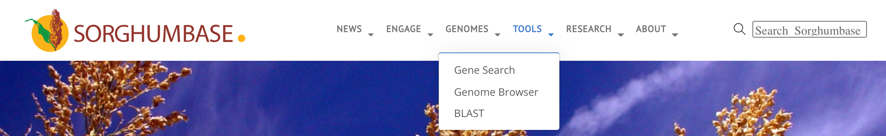
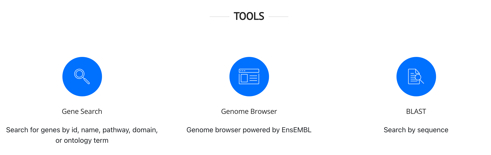

## Guide to use BLAST in SorghumBase

*This guide demonstrates hot to BLAST nucleotide and protein sequence in SorghumBase.*

- [What is BLAST?](#define-blast)
- [Where is BLAST?](#go-to-blast)
- [BLAST nucleotides](#blast-dna)
- [BLAST amino acids](#blast-protein)

## Define BLAST {#define-blast}

The Basic Local Alignment Search Tool (BLAST) allows researchers to find regions of similarity between biological sequences. The program compares nucleotide or protein sequences to sequence databases and calculates the statistical significance. 

Check out [NCBI's page for BLAST](https://blast.ncbi.nlm.nih.gov/Blast.cgi). 

## Go to the BLAST page of SorghumBase {#go-to-blast}

The direct URL for the SorghumBase knowledgebase is [https://ensembl.sorghumbase.org/Tools/Blast](https://ensembl.sorghumbase.org/Tools/Blast).

Here are other ways to intituitively get to the same page:

1) Select BLAST from the TOOLS drop-down menu on the SorghumBase homepage.

2) Click on the Tools icon on the SorghumBase homepage, and subsequently click on the BLAST icon

3) There is also a BLAST link in the header of each page in the genome browser site.

4) On browser pages that display a sequence such as [https://ensembl.sorghumbase.org/Sorghum_bicolor/Transcript/Sequence_cDNA?db=core;g=SORBI_3009G229800;r=9:57038653-57041166;t=KXG22524](the cDNA page for SORBI_3006G108000), the sorghum ortholog of rice <i>dw2</i>, click the button to BLAST this sequence.

## BLASTing a gene's DNA sequence {#blast-dna}

## BLASTing a gene's amino acid sequence {#blast-protein}

