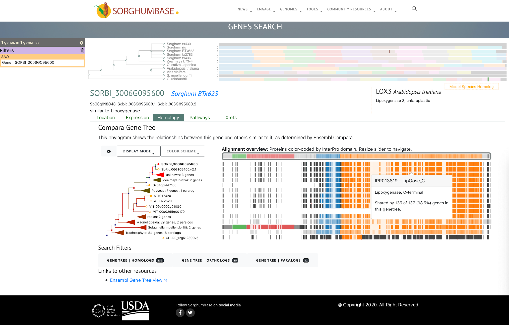
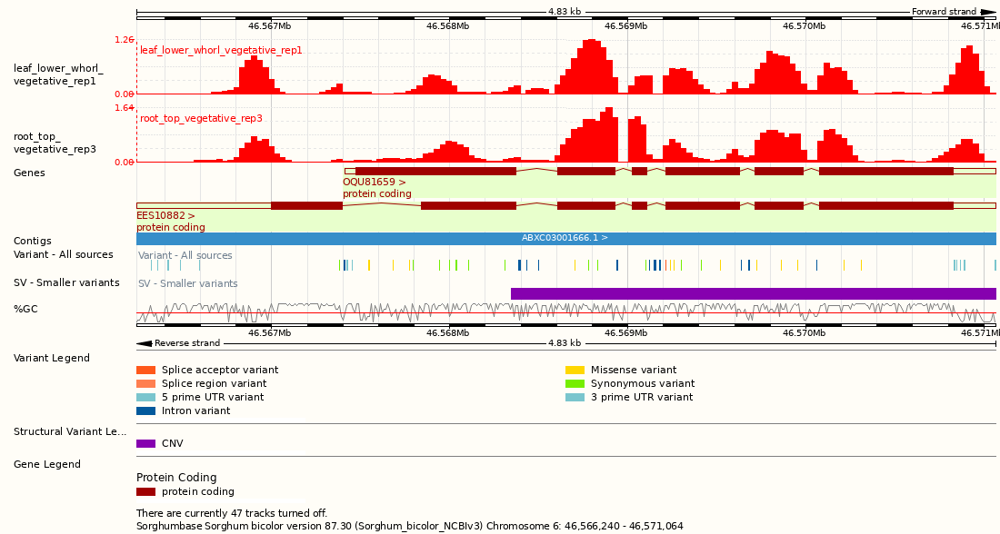

## *Sorghum bicolor* BTx623

*Types of data available for this variant and tips on how to find it.*

## Querying a Sorghum bicolor BTx623 Gene

Search Results Summary

The results of a gene search are organized in five data categories:

- Location - Genomic context
  - Gramene
  - Pangenome site
  - phytozome
- Expression - Baseline gene expression from [EBI-Expression Atlas](https://www.ebi.ac.uk/gxa)
- Homology - Customizable Ensembl Compara gene family trees with displays:
  - Alignment Overview
  - Multiple-Sequence Alignment
  - Neighborhood Conservation View
- Pathways - Association to pathways in [Gramene’s Plant Reactome](https://plantreactome.gramene.org)
- Xrefs - Cross-references to other databases

The example below shows the default view of the results when searching for the [SORBI_3006G095600](https://dev.sorghumbase.org/genes?filters={%22status%22:%22init%22,%22operation%22:%22AND%22,%22negate%22:false,%22marked%22:false,%22leftIdx%22:0,%22rightIdx%22:3,%22children%22:[{%22fq_field%22:%22id%22,%22fq_value%22:%22SORBI_3006G095600%22,%22name%22:%22SORBI_3006G095600%22,%22category%22:%22Gene%22,%22leftIdx%22:1,%22rightIdx%22:2,%22negate%22:false,%22showMenu%22:false,%22marked%22:true}],%22showMarked%22:true,%22showMenu%22:false,%22moveCopyMode%22:%22%22,%22searchOffset%22:0,%22rows%22:20}&genomes=) gene (msd2).

## Gene page
A [gene page](https://ensembl.sorghumbase.org/Sorghum_bicolor/Gene/Summary?g=SORBI_3006G095600;r=6:46566240-46571064),
[transcript page](https://ensembl.sorghumbase.org/Sorghum_bicolor/Transcript/Summary?db=core;g=SORBI_3006G095600;r=6:46566240-46571064;t=OQU81659),
[(SNP) variant page](https://ensembl.sorghumbase.org/Sorghum_bicolor/Variation/Explore?db=core;g=SORBI_3006G095600;r=6:46566240-46571064;t=OQU81659;v=tmp_6_47487513_G_A;vdb=variation;vf=7758800),
and [structural variant page](https://ensembl.sorghumbase.org/Sorghum_bicolor/StructuralVariation/Explore?db=core;g=SORBI_3006G095600;r=6:46566240-46571064;sv=nsv856002;svf=54084;t=OQU81659;v=tmp_6_47487513_G_A;vdb=variation;vf=7758800) (tabs) in the Ensembl browser.

## Comparative Genomics
The following comparative genomics data for BTx623 are available in the SorghumBase genome browser:

- Gene trees (Ensembl Compara pipeline) - [Example](http://ensembl.sorghumbase.org/Sorghum_bicolor/Gene/Compara_Tree?g=SORBI_3006G095600;r=6:46566240-46571064;collapse=2831659,2829950,2830021)

- Genome-wide alignment to *Oryza sativa* Japonica (see [example region](http://ensembl.sorghumbase.org/Sorghum_bicolor/Location/Multi?align=23;db=core;g=SORBI_3006G095600;r=6:46563088-46605099;r1=4:22284737-22339738:1;s1=Oryza_sativa))

- Synteny maps with:
  - Rio
  - RTx430
  - TX2783
  - RTx436
  - *Zea mays* V4 (see [example](http://ensembl.sorghumbase.org/Sorghum_bicolor/Location/Synteny?r=6%3A46563088-46605099&db=core&g=SORBI_3006G095600&otherspecies=Zea_maysb73v4))
  - *Oryza sativa* Japonica

    
## Regulation
### Epigenomics
Genome-wide epigenetic marks related to root system morphology and architecture in sorghum BTx623 deposited under
BioProject [PRJNA454504](https://www.ncbi.nlm.nih.gov/bioproject/PRJNA454504/) (Gladman et al, manuscript in prep.).
Three repetitions available for each of seven samples: leaf lower (vegetative whorl), leaf upper (growing anthesis),
panicle (upper anthesis), root bottom (anthesis), root top (vegetative), stem 1 cm (vegetative) and stem mid internode (anthesis).
- The [example](https://ensembl.sorghumbase.org/Sorghum_bicolor/Location/View?db=core;g=SORBI_3006G095600;r=6:46566240-46571064)
  below shows two samples with very similar patterns of epigenetic variation for the msd2 gene region.

### Baseline Gene Expression (Atlas)

Baseline gene expression data from seven sorghum BTx623 datasets curated and processed by the [EMBL-EBI Expression Atlas](https://www.ebi.ac.uk/gxa/)
[(Emms et al. 2016; Makita et al. 2015; Davidson et al. 2012; Turco et al. 2017; Wang et al. 2018; Olson et al. 2014) and
BioProject [PRJNA293229](https://www.ncbi.nlm.nih.gov//bioproject/PRJNA293229)/[SRP062564](https://trace.ncbi.nlm.nih.gov/Traces/sra?study=SRP062564) by Thurber et al (2015)].
- The [example](https://ensembl.sorghumbase.org/Sorghum_bicolor/Gene/ExpressionAtlas?db=core;g=SORBI_3004G141800;r=4:41625307-41663480;t=OQU84910;v=S4_41077528;vdb=variation;vf=112207) below shows Baseline gene expression for the msd2 gene. 
