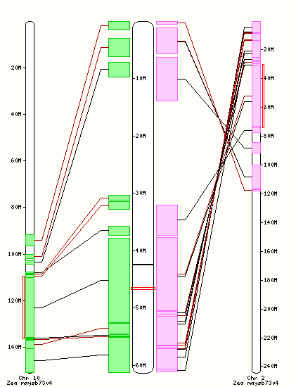

## Genomic resources available for *Sorghum bicolor* BTx623

*This guide demonstrates genomic resources available through SorghumBase.*

The examples below focus on MSD2, a gene which encodes a lipoxygenase (LOX) that catalyzes the first
committed step of jasmonic acid biosynthesis. For more info on this gene see [Gladman *et al* (2019)](https://www.sorghumbase.org/paper/fertility-of-pedicellate-spikelets-in-sorghum-is-controlled-by-a-jasmonic-acid-regulatory-module).

- [Genes search interface](#search-interface)
- [Searching for a gene](#gene-search)
- [Ensembl Gene page](#gene-page)
- [Add/remove data tracks](#configure-image)
- [Ensembl Comparative Genomics](#comparative-genomics)
- [Regulation](#regulation)
- [Gene expression](#gene-expression)
- [Variation](#variation)
- [QTLs](#qtls)
  
## Using the genes search interface {#search-interface}

Watch the [demo video on YouTube](https://www.youtube.com/watch?v=nnAEnA9qTMY&t=2s).

Searching for a gene given a standard gene identifier can be done in a couple of ways:
- Click the spyglass icon and type/paste `Sobic.006G095600` it into the search box, for example 
- Link directly to [http://sorghumbase.org/genes?idList=Sobic.006G095600](https://www.sorghumbase.org/genes?idList=Sobic.006G095600)

If you don't know the gene id you can search by pathway and taxonomy [example](https://www.sorghumbase.org/genes?filters={%22status%22:%22init%22,%22operation%22:%22AND%22,%22negate%22:false,%22marked%22:false,%22leftIdx%22:0,%22rightIdx%22:5,%22children%22:[{%22fq_field%22:%22pathways__ancestors%22,%22fq_value%22:%221119332%22,%22name%22:%22Jasmonic%20acid%20biosynthesis%22,%22category%22:%22Plant%20Reactome%20Pathway%22,%22leftIdx%22:1,%22rightIdx%22:2,%22negate%22:false,%22showMenu%22:false,%22marked%22:false},{%22fq_field%22:%22taxonomy__ancestors%22,%22fq_value%22:%224558%22,%22name%22:%22Sorghum%20BTx623%22,%22category%22:%22Taxonomy%22,%22leftIdx%22:3,%22rightIdx%22:4,%22negate%22:false,%22showMenu%22:false,%22marked%22:true}],%22showMarked%22:true,%22showMenu%22:false,%22moveCopyMode%22:%22%22,%22searchOffset%22:0,%22rows%22:20}&genomes=):

1. In the search box, start typing `jasmonic acid biosynthesis` and choose the matching Plant Reactome Pathway term
2. To limit the search to genes in *Sorghum bicolor* BTx623, type `sorghum` in the search box and select the matching Taxonomy term

The search results page is organized into three areas:

1. A panel on the left side shows the status of the search
2. At the top is a visualization of the genomic locations of genes matching the search
3. Below this is a paginated list of genes

Each gene has a set of tabs that can be expanded to explore more details:

- **Germplasm** - Germplasm bearing a protein-truncating variant (PTV), specifically a PTV's putative loss-of-function allele
- **Sequences** - Genomic, transcript and peptide sequences
- **Location** - Lightweight genome browser showing gene structure
- **Expression** - Baseline gene expression viewer from [EBI-Expression Atlas](https://www.ebi.ac.uk/gxa)
- **Homology** - Gene family tree viewer (opens by default if only one gene is found)
- **Pathways** - Associated pathways in [Gramene’s Plant Reactome](https://plantreactome.gramene.org)
- **Xrefs** - Cross-references to other databases

## Searching for a gene – Gene ID equivalences {#gene-search}

_**NOTE: Gene models mapped to the v5.1 assembly have a ".v5.1" suffix appended to the corresponding Sobic gene identifier like so: [Sobic.006G095600.v5.1](https://ensembl.sorghumbase.org/sorghum_bicolorv5/Gene/Summary?g=Sobic.001G121600.v5.1). However, searching for the Sobic gene identifier (Sobic.006G095600) will return both models (v3 and v5).**_

The SorghumBase search interface is not case sensitive and it allows you to search sorghum gene identifiers (IDs) of the form Sobic.* (JGI v2.1 and above), older gene IDs of the form SbXXX (MIPS/JGI Sbi1.4 or JGI v5.1 in Phytozome), and Ensembl gene IDs of the form SORBI_3*. Thus, you may search for our exemplar MSD2 gene using Sb06g018040, SORBI_3006G095600, Sobic.006G095600 or Sobic.006G095600.v5.1 (i.e., gene synonyms or different versions of the same gene model).

You may convert any Sobic.* to its corresponding SbXXX gene ID (JGI v2.1) using a synonyms mapping file such as Sbicolor_730_v5.1.synonym.txt (or [Sbicolor_255_v2.1.locus_transcript_name_map.txt](https://genome.jgi.doe.gov/portal/Phytozome/download/_JAMO/55fca1de0d8785306f968fa1/Sbicolor_255_v2.1.locus_transcript_name_map.txt) from Phytozome. Gene identifiers may be converted to JGI v5.1 by adding the '.v5.1' suffix to the JGI v2.1 identifer. The file provides mapping of *S. bicolor* gene IDs from MIPS/JGI Sbi1.4 to v2.1 and higher builds.

The file looks like this:

new MIPS/JGI Sbi2.1 [Sobic.006G095600] ⇔ old MIPS/JGI Sbi1.4 [Sb06g018040]

#new-locusName    old-locusName

Sobic.006G095600	Sb06g018040	

The following rule applies for the conversion between Sobic.* and Ensembl gene nomenclature in use at SorghumBase:

Sobic.* => SORBI_3*

For example:

Sobic.006G095600 = SORBI_3006G095600

and 

Sobic.006G095600.v5.1 = Sobic.006G095600

## Gene page {#gene-page}
More detailed views available in the SorghumBase Ensembl genome browser include
[gene pages](https://ensembl.sorghumbase.org/Sorghum_bicolor/Gene/Summary?g=SORBI_3006G095600;r=6:46566240-46571064),
[transcript pages](https://ensembl.sorghumbase.org/Sorghum_bicolor/Transcript/Summary?db=core;g=SORBI_3006G095600;r=6:46566240-46571064;t=OQU81659),
and [(SNP) variant pages](https://ensembl.sorghumbase.org/Sorghum_bicolor/Variation/Explore?db=core;g=SORBI_3006G095600;r=6:46566240-46571064;v=rs5437819034;vdb=variation;vf=47523480).

## Add/remove data tracks or configure an image on the genome browser {#configure-image}

Find the spider gear icon on a browser page, it might precede a "Configure this page" or have a "Configure this image" title when you mouse over it (see image below). When you click on it, you will be able to select or turn on/off a data track (click on a category to disclose all the tracks under it, the number of data sets (tracks) is indicated to the right of each category, for example in the first release of SorghumBase, there are 5 data tracks under Variation (the later two being EMS mutations): Sequence variants (all sources), SAP_Boatwrigjt_study variants, Lozano_study variants, Yinping-Jiao-2016-Study variants, and Addo-Quaye variants. Click on the square to the left of each data set (track) to select from several options. For example, you may choose to turn the track off or display its data in a collapsed or expanded manner, with or without labels for each data point.

## Comparative Genomics {#comparative-genomics}
The following comparative genomics data for BTx623 are available in the SorghumBase Ensembl genome browser:

- Gene trees - [Example](http://ensembl.sorghumbase.org/Sorghum_bicolor/Gene/Compara_Tree?g=SORBI_3006G095600;r=6:46566240-46571064;collapse=2831659,2829950,2830021)

- Genome-wide alignments - As of release 7, there are five pairwise genomic alignments for each one of the following sorghum genomes with Nipponbare rice:

  - _Sorghum bicolor_ ssp. _bicolor_ BTx623 v3 [example region chr6:46563088-46605099](https://ensembl.sorghumbase.org/Sorghum_bicolor/Location/Multi?align=23;db=core;g=SORBI_3006G095600;r=6:46563088-46605099;r1=4:22284737-22339738:1;s1=Oryza_sativa)
  - _Sorghum bicolor_ ssp. _bicolor_ RTx430 [example region Scaffold_2:9302463-9340387](https://ensembl.sorghumbase.org/Sorghum_tx430nano/Location/Multi?db=core;g=3381.casb002g029200.635;r=Scaffold_2:9302463-9340387;r1=2:15827011-15864935:1;s1=Oryza_sativa)
  - _Sorghum bicolor_ ssp. _bicolor_ RTx436 [example region chr1:12237500-12292501](https://ensembl.sorghumbase.org/Sorghum_tx436pac/Location/Multi?db=core;r=1:12237500-12292501;r1=3:25255605-25310606:-1;s1=Oryza_sativa)
  - _Sorghum bicolor_ ssp. _bicolor_ Tx2783 [example region chr1:12260000-12272000](https://ensembl.sorghumbase.org/Sorghum_tx2783pac/Location/Multi?db=core;r=1:12260000-12272000;r1=3:4984605-4996605:1;s1=Oryza_sativa)
  - _Sorghum bicolor_ ssp. _bicolor_ Rio - PI651496 [example region chr1:12260000-12290000](https://ensembl.sorghumbase.org/Sorghum_rio/Location/Multi?db=core;r=1:12260000-12290000;r1=3:25886785-25916785:-1;s1=Oryza_sativa)
    

- Synteny maps - As of release 7, we have 56 synteny maps between sorghum BTx623 v3 and each of 27 sorghum genomes, Nipponbare rice IRGSPv1, and poplar v4; and between each of the sorghum genomes and Nipponbare. Example of [synteny map for sorghum BTx623 v3 at chr4:61,032,110-61,070,283 and Nipponbare IRGSPv1](https://ensembl.sorghumbase.org/Sorghum_bicolor/Location/Synteny?r=4%3A61032110-61070283&db=core&otherspecies=Oryza_sativa).

    
## Regulation {#regulation}
RNA-Seq expression data related to root system morphology and architecture in sorghum BTx623 deposited under
BioProject [PRJNA454504](https://www.ncbi.nlm.nih.gov/bioproject/PRJNA454504/) (Gladman et al, manuscript in prep.).
Three repetitions available for each of seven samples: leaf lower (vegetative whorl), leaf upper (growing anthesis),
panicle (upper anthesis), root bottom (anthesis), root top (vegetative), stem 1 cm (vegetative) and stem mid internode (anthesis).
- The [example](https://ensembl.sorghumbase.org/Sorghum_bicolor/Location/View?db=core;g=SORBI_3006G095600;r=6:46566240-46571064)
  below shows two samples with very similar patterns of gene expression for the msd2 gene region.

### Baseline Gene Expression (Atlas) {#gene-expression}

Baseline gene expression data from seven sorghum BTx623 datasets curated and processed by the [EMBL-EBI Expression Atlas](https://www.ebi.ac.uk/gxa/)
[(Emms et al. 2016; Makita et al. 2015; Davidson et al. 2012; Turco et al. 2017; Wang et al. 2018; Olson et al. 2014) and
BioProject [PRJNA293229](https://www.ncbi.nlm.nih.gov//bioproject/PRJNA293229)/[SRP062564](https://trace.ncbi.nlm.nih.gov/Traces/sra?study=SRP062564) by Thurber et al (2015)].
- The [example](https://ensembl.sorghumbase.org/Sorghum_bicolor/Gene/ExpressionAtlas?db=core;g=SORBI_3004G141800;r=4:41625307-41663480;t=OQU84910;v=S4_41077528;vdb=variation;vf=112207) below shows Baseline gene expression for the msd2 gene. 

The above view depicts baseline gene expression data for a whole plant (top anatogram on the left of the results box) and for the plant’s reproductive organs (bottom anatogram). Experiments are organized by study on the left side, and by tissue or developmental stage on the top of the graph. Unique data points are colored in blue, with intensity increasing in proportion to the level of expression (i.e., higher expression data points are shown in darker blue). When you hover the cursor over a data point, the data point is highlighted in yellow, a more detailed summary pops up, and the corresponding tissue is colored in pink in the anatograms. If instead, you hover over a tissue on the anatogram on the left, the name of the tissue will pop up, and the points corresponding to expression data from this tissue will light up. This feature is the product of the collaboration with the EBI-Atlas. 

## Variation {#variation}
Variation in SorghumBase is available for short variants (genetic variation, which in turn may be naturally occurring or chemically induced) and QTL variants associated with physical traits.

### Genetic & Phenotypic Variation

Genetic variation data sets are available as over 59 million sorghum variants including more than 46 million naturally ocurring Single Nucleotide Polymorphisms (SNPs), and almost 13 million chemically-induced variants (i.e., ethyl methanesulfonate (EMS)-induced mutations). In addition, we host nearly 6,000 QTLs for 148 sorghum traits from the Sorghum QTL Atlas.

### Naturally occurring genetic variation - SNPs

Currently in SorghumBase, there are three SNPs data sets, two on sorghum BTx623 and one on Tx2783.

#### BTx623

- The Lozano SNP dataset [(Lozano et al, 2021)](https://www.sorghumbase.org/paper/comparative-evolutionary-genetics-of-deleterious-load-in-sorghum-and-maize) consists of about 13 million SNPs in 499 sorghum accessions, including lines from the TERRA-MEPP and TERRA-REF population panels, and the samples previously reported by Emma Mace and collaborators [(Mace et al, 2013)](https://www.sorghumbase.org/paper/21275).

- The Boatwright SNP dataset [(Boatwright et al, 2022)](https://www.sorghumbase.org/paper/20741) consists of over 33 million SNPs and indels genotyped in 378 Sorghum Association Panel (SAP) accessions via whole-genome sequencing (WGS).

#### Tx2783

- About 32.5 million SNPs were called in 400 SAP lines by Rod Wing's group at King Abdullah University of Science and Technology with the GATK4 pipeline [Zhou et al (2024)](https://www.sorghumbase.org/paper/23243), and are now available from the Tx2783 genome browser. See for example [4_6047465_C_T](https://ensembl.sorghumbase.org/Sorghum_tx2783pac/Variation/Sample?db=core;r=4:6046965-6047965;v=4_6047465_C_T;vdb=variation;vf=11387812), a SNP predicted to introduce a STOP codon and result in a truncated [SbiRTX2783.04G076100](https://ensembl.sorghumbase.org/Sorghum_tx2783pac/Gene/Summary?db=core;g=SbiRTX2783.04G076100;r=4:6046424-6048133;t=SbiRTX2783.04G076100.1;v=4_6047465_C_T;vdb=variation;vf=11387812) protein product.

### Chemically induced genetic variation -  EMS-induced mutations
Currently in SorghumBase, there are three collections of EMS-induced mutant lines. EMS is a chemical commonly used to cause point mutations, that is, to change single nucleotides in the DNA of a plant seed.

- The Jiao_2016 dataset [(Jiao et al, 2016)](https://www.sorghumbase.org/paper/21276) includes over 1.7 million EMS-induced G/C to A/T transition mutations annotated from 252 M3 mutant family pools selected from the 6,400 sorghum mutant library in BTx623 background described by Xin and colleagues (Xin et al. 2008). Genomic DNA used for sequencing was pooled from 20 x M3 plants per M2 family (Jiao et al. 2016). This set superseded the 1.5 million mutations originally called in the Jiao study. 
- The Addo-Quaye dataset [(Addo-Quaye et al, 2018)](https://www.sorghumbase.org/paper/19942) with over 2.5 million variations identified in 486 sorghum accessions from the M3 generation of an EMS-mutagenized sorghum population.
- The Jiao_2023 dataset [(Jiao et al, 2023)](https://www.sorghumbase.org/paper/23165) includes 8.9 million EMS mutations in 890 accessions, also available from the SorbMutDB resource.

Genetic variation data for a sorghum gene is available graphically and in tabular form, and for each variant, a Variant page provides more detailed information. Below are provided examples of each of these data representations.

- An [image](https://ensembl.sorghumbase.org/Sorghum_bicolor/Transcript/Variation_Transcript/Image?db=core;g=SORBI_3006G095600;r=6:46566240-46571064;t=SORBI_3006G095600.2;v=tmp_3_61561138_G_A;vdb=variation;vf=3821694) of all the genetic variants mapping to the smaller transcript of the msd2 gene.

- A [table](https://ensembl.sorghumbase.org/Sorghum_bicolor/Transcript/Variation_Transcript/Table?db=core;g=SORBI_3006G095600;r=6:46566240-46571064;t=SORBI_3006G095600.2;v=tmp_3_61561138_G_A;vdb=variation;vf=3821694) of all the Protein Truncated Variants (PTVs) mapping to the smaller transcript of the msd2 gene.

- An example of a [Variant summary page](https://ensembl.sorghumbase.org/Sorghum_bicolor/Variation/Explore?db=core;g=SORBI_3006G095600;r=6:46566240-46571064;t=SORBI_3006G095600.2;v=tmp_6_46568836_C_T;vdb=variation;vf=23559994)
  for a chemically induced variant (tmp_6_46568836_C_T) that results in a _STOP gained_ with a smaller inset of the [genotype frequency panel](https://ensembl.sorghumbase.org/Sorghum_bicolor/Variation/Sample?db=core;g=SORBI_3006G095600;r=6:46566240-46571064;t=SORBI_3006G095600.2;v=tmp_6_46568836_C_T;vdb=variation;vf=23559994) showing the accession (LBK_15M2-1535) bearing the mutation (C|T).

### Phenotypic Variation - Quantitative Trait Locus (QTLs) {#qtls}
Data corresponding to 5,843 QTL features for 220 sorghum traits were imported from [OZ Sorghum QTL Atlas](https://aussorgm.org.au/sorghum-qtl-atlas/), and 7,123 rice QTLs from [Gramene](https://www.gramene.org/). All QTLs are now searchable, for example: [sorghum grain mold](https://sorghumbase.org/genes?filters=%7B%22status%22:%22init%22,%22operation%22:%22AND%22,%22negate%22:false,%22marked%22:false,%22leftIdx%22:0,%22rightIdx%22:3,%22children%22:%5B%7B%22fq_field%22:%22QTL_TO__ancestors%22,%22fq_value%22:%2220008%22,%22name%22:%22sorghum%20grain%20mold%22,%22category%22:%22QTLs%22,%22leftIdx%22:1,%22rightIdx%22:2,%22negate%22:false,%22showMenu%22:false,%22marked%22:true%7D%5D,%22showMarked%22:true,%22showMenu%22:false,%22moveCopyMode%22:%22%22,%22searchOffset%22:0,%22rows%22:20%7D&genomes=).

Check another [example region](https://ensembl.sorghumbase.org/Sorghum_bicolor/Location/View?db=core;g=SORBI_3006G095600;r=7:61190510-61277060;sv=nsv856002;svf=54084;t=OQU81659;vdb=variation) with QTLs associated with multiple traits including greenbug resistance, fresh biomass, and flag leaf height. 
  
You may need to turn on the QTLs track and select how you would like the data displayed on your browser. For the figure shown below, I selected "Collapsed" style, which limits the dispaly to only 5 QTLs in the image. Click on a track to disclose more information about that data point (for example, QTL name, location, associated phenotype and data source). In the example below, if you click on a phenotype/trait, such as "Green bug resistance", you will be taken to a page listing all the genomic locations of QTL features associated with Green bug resistance. See an [example of such list for Panicle length](https://ensembl.sorghumbase.org/Sorghum_bicolor/Phenotype/Locations?ph=114). 
  

Hint: For additional regions with QTL data in the current sorghum assembly (v.3), use the [physical or genetic (cM) coordinates](http://aussorgm.org.au/dev/wp-content/uploads/2018/08/Consensus-Map_cM-and-bp-coordinates.xlsx) kindly provided by the Sorghum QTL Atlas team.

## References {#references}

Addo-Quaye C, Tuinstra M, Carraro N, Weil C, Dilkes BP. 2018. "Whole-Genome Sequence Accuracy Is Improved by Replication in a Population of Mutagenized Sorghum." *G3* 8: 1079–1094. 
PMID: 29378822. https://doi.org/10.1534/g3.117.300301.

Aken, Bronwen L., Sarah Ayling, Daniel Barrell, Laura Clarke, Valery Curwen, Susan Fairley, Julio Fernandez Banet, et al. 2016.
"The Ensembl Gene Annotation System."
*Database: The Journal of Biological Databases and Curation*.
PMID: 27337980. https://doi.org/10.1093/database/baw093.

Boatwright JL, Sapkota S, Jin H, Schnable JC, Brenton Z, Boyles R, Kresovich S. 2022. "Sorghum Association Panel whole-genome sequencing establishes cornerstone resource for dissecting genomic diversity". *Plant J* 
PMID: 35653240. https://doi.org/10.1111/tpj.15853.

Brenton, Zachary W., Elizabeth A. Cooper, Mathew T. Myers, Richard E. Boyles, Nadia Shakoor, Kelsey J. Zielinski, Bradley L. Rauh, William C. Bridges, Geoffrey P. Morris, and Stephen Kresovich. 2016.
"A Genomic Resource for the Development, Improvement, and Exploitation of Sorghum for Bioenergy."
*Genetics* 204 (1): 21–33.
PMID: 27356613. https://doi.org/10.1534/genetics.115.183947.

Casa, Alexandra M., Gael Pressoir, Patrick J. Brown, Sharon E. Mitchell, William L. Rooney, Mitchell R. Tuinstra, Cleve D. Franks, and Stephen Kresovich. 2008.
"Community Resources and Strategies for Association Mapping in Sorghum."
*Crop Science* 48 (1): 30–40.
https://doi.org/10.2135/cropsci2007.02.0080.

Davidson, Rebecca M., Malali Gowda, Gaurav Moghe, Haining Lin, Brieanne Vaillancourt, Shin-Han Shiu, Ning Jiang, and C. Robin Buell. 2012.
"Comparative Transcriptomics of Three Poaceae Species Reveals Patterns of Gene Expression Evolution."
*The Plant Journal: For Cell and Molecular Biology* 71 (3): 492–502.
PMID: 22443345. https://doi.org/10.1111/j.1365-313X.2012.05005.x.

Emms, David M., Sarah Covshoff, Julian M. Hibberd, and Steven Kelly. 2016.
"Independent and Parallel Evolution of New Genes by Gene Duplication in Two Origins of C4 Photosynthesis Provides New Insight into the Mechanism of Phloem Loading in C4 Species."
*Molecular Biology and Evolution* 33 (7): 1796–1806.
PMID: 27016024. https://doi.org/10.1093/molbev/msw057.

Gladman, N. et al. "Sorghum root epigenetic landscape during limiting phosphorus conditions." *Manuscript in preparation*.

Goodstein, David M., Shengqiang Shu, Russell Howson, Rochak Neupane, Richard D. Hayes, Joni Fazo, Therese Mitros, et al. 2012.
"Phytozome: A Comparative Platform for Green Plant Genomics."
*Nucleic Acids Research* 40 (Database issue): D1178–86.
PMID: 22110026. https://doi.org/10.1093/nar/gkr944.

Jiao, Yinping, John J. Burke, Ratan Chopra, Gloria Burow, Junping Chen, Bo Wang, Chad Hayes, Yves Emendack, Doreen Ware, and Zhanguo Xin. 2016.
"A Sorghum Mutant Resource as an Efficient Platform for Gene Discovery in Grasses."
*The Plant Cell*.
PMID: 27354556. https://doi.org/10.1105/tpc.16.00373.

Jiao Y, Nigam D, Barry K, Daum C, Yoshinaga Y, Lipzen A, Khan A, Parasa SP, Wei S, Lu Z, Tello-Ruiz MK, Dhiman P, Burow G, Hayes C, Chen J, Brandizzi F, Mortimer J, Ware D, Xin Z. 2023. "A large sequenced mutant library – valuable reverse genetic resource that covers 98% of sorghum genes." The Plant Journal 117(5):1543-1557. doi: [10.1111/tpj.16582](https://doi.org/10.1111/tpj.16582).

Lozano R, Gazave E, Dos Santos JPR, Stetter MG, Valluru R, Bandillo N, et al. 2021. "Comparative evolutionary genetics of deleterious load in sorghum and maize." *Nat Plants* 7:17–24. 
PMID: 33452486. https://doi.org/10.1038/s41477-020-00834-5.

McCormick, Ryan F., Sandra K. Truong, Avinash Sreedasyam, Jerry Jenkins, Shengqiang Shu, David Sims, Megan Kennedy, et al. 2018.
"The Sorghum Bicolor Reference Genome: Improved Assembly, Gene Annotations, a Transcriptome Atlas, and Signatures of Genome Organization."
*The Plant Journal: For Cell and Molecular Biology* 93 (2): 338–54.
PMID: 29161754. https://doi.org/10.1111/tpj.13781.

Mace, Emma S., Shuaishuai Tai, Edward K. Gilding, Yanhong Li, Peter J. Prentis, Lianle Bian, Bradley C. Campbell, et al. 2013.
"Whole-Genome Sequencing Reveals Untapped Genetic Potential in Africa’s Indigenous Cereal Crop Sorghum."
*Nature Communications* 4: 2320.
PMID: 23982223. http://doi.org/10.1038/ncomms3320.

Makita, Yuko, Setsuko Shimada, Mika Kawashima, Tomoko Kondou-Kuriyama, Tetsuro Toyoda, and Minami Matsui. 2015.
"MOROKOSHI: Transcriptome Database in Sorghum Bicolor."
*Plant & Cell Physiology* 56 (1): e6.
PMID: 25505007. https://doi.org/10.1093/pcp/pcu187.

Morris, Geoffrey P., Punna Ramu, Santosh P. Deshpande, C. Thomas Hash, Trushar Shah, Hari D. Upadhyaya, Oscar Riera-Lizarazu, et al. 2013.
"Population Genomic and Genome-Wide Association Studies of Agroclimatic Traits in Sorghum."
*Proceedings of the National Academy of Sciences of the United States of America* 110 (2): 453–58.
PMID: 23267105. https://doi.org/10.1073/pnas.1215985110.

Mural RV, Grzybowski M, Miao C, Damke A, Sapkota S, Boyles RE, Fernandez MGS, Schnable PS, Sigmon B, Kresovich S, Schnable JC. 2021. "Meta-analysis identifies pleiotropic loci controlling phenotypic trade-offs in sorghum." Genetics 218:3. doi: [10.1093/genetics/iyab087](https://doi.org/10.1093/genetics/iyab087).

Olson, Andrew, Robert R. Klein, Diana V. Dugas, Zhenyuan Lu, Michael Regulski, Patricia E. Klein, and Doreen Ware. 2014.
"Expanding and Vetting Sorghum Bicolor Gene Annotations through Transcriptome and Methylome Sequencing."
*The Plant Genome* 7 (2): plantgenome2013.08.0025. https://doi.org/10.3835/plantgenome2013.08.0025.

Paterson, A. H., J. E. Bowers, R. Bruggmann, I. Dubchak, J. Grimwood, H. Gundlach, G. Haberer, et al. 2009.
"The Sorghum Bicolor Genome and the Diversification of Grasses."
*Nature* 457 (7229): 551–56.
PMID: 19189423. https://doi.org/10.1038/nature07723.

Turco, Gina M., Kaisa Kajala, Govindarajan Kunde-Ramamoorthy, Chew-Yee Ngan, Andrew Olson, Shweta Deshphande, Denis Tolkunov, et al. 2017.
"DNA Methylation and Gene Expression Regulation Associated with Vascularization in Sorghum Bicolor."
*The New Phytologist* 214 (3): 1213–29.
PMID: 28186631. https://doi.org/10.1111/nph.14448.

Xin, Zhanguo, Ming Li Wang, Noelle A. Barkley, Gloria Burow, Cleve Franks, Gary Pederson, and John Burke. 2008.
"Applying Genotyping (TILLING) and Phenotyping Analyses to Elucidate Gene Function in a Chemically Induced Sorghum Mutant Population."
*BMC Plant Biology*.
PMID: 18854043. https://doi.org/10.1186/1471-2229-8-103.

Wang, Bo, Michael Regulski, Elizabeth Tseng, Andrew Olson, Sara Goodwin, W. Richard McCombie, and Doreen Ware. 2018.
"A Comparative Transcriptional Landscape of Maize and Sorghum Obtained by Single-Molecule Sequencing."
*Genome Research* 28 (6): 921–32.
PMID: 29712755. https://doi.org/10.1101/gr.227462.117.

Zheng, Lei-Ying, Xiao-Sen Guo, Bing He, Lian-Jun Sun, Yao Peng, Shan-Shan Dong, Teng-Fei Liu, et al. 2011.
"Genome-Wide Patterns of Genetic Variation in Sweet and Grain Sorghum (Sorghum Bicolor)."
*Genome Biology* 12 (11): R114.
PMID: 22104744. http://dx.doi.org/10.1186/gb-2011-12-11-r114.

Zhou Y, Kathiresan N, Yu Z, Rivera LF, Yang Y, Thimma M, Manickam K, Chebotarov D, Mauleon R, Chougule K, Wei S, Gao T, Green CD, Zuccolo A, Xie W, Ware D, Zhang J, McNally KL, Wing RA. 2024. "A high-performance computational workflow to accelerate GATK SNP detection across a 25-genome dataset." BMC biology. doi: [10.1186/s12915-024-01820-5](https://doi.org/10.1186/s12915-024-01820-5).

